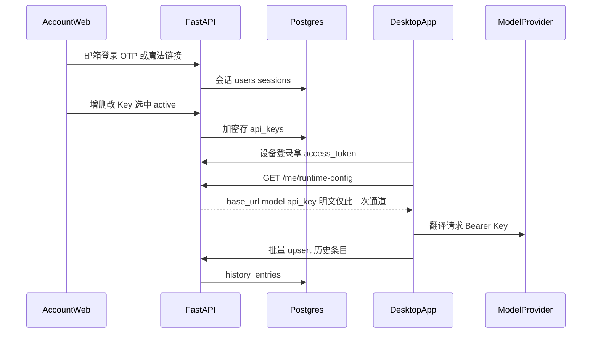

> 归档说明：本文件由 Cursor 计划 `自建账户与同步_5316003c.plan.md` 入库。状态见文首 YAML；版本对照见 [`VERSION-PLANS.md`](../../VERSION-PLANS.md)。
> 现行未做清单见 [`todo/account-sync-byok.md`](../../todo/account-sync-byok.md)。

# 自建账户体系与多端同步计划

## 产品结论

- **Key 归属**：用户自己的厂商 Key；云端只做加密保管与多端下发。
- **调用路径**：桌面端拿到配置后 **直连** `base_url`（如 DeepSeek），**不做** 你们后端的 LLM 中转/计费。
- **后端形态**：自建（非 Supabase）。推荐栈：**FastAPI + PostgreSQL + Redis（可选）+ 简单 Web 管理页**。
- **历史**：默认 **完整云端备份**（按条目幂等上传/拉取）；本地 JSONL 仍作离线缓存。

与现状关系：今天 Key 在本地 [`config.toml`](config.toml) / [`config.py`](config.py)，历史在 [`history_store.py`](history_store.py) 的 `data/history-YYYY-MM-DD.jsonl`。账号体系是在之上增加「云配置源 + 同步层」，本地模式可保留作未登录兜底。

## 总体架构

| 组件 | 职责 |
|------|------|
| **API 服务** | 认证、Key CRUD、下发 runtime config、历史同步 |
| **Postgres** | 用户、会话、加密 Key、选用状态、历史条目 |
| **Account Web** | 邮箱登录、管理多把 Key、设「当前使用」、看同步状态 |
| **Desktop** | 登录、拉取配置、写本地缓存、上传/拉取历史；翻译仍走现有 [`translator.py`](translator.py) |

建议仓库形态（同一 monorepo 或旁路目录均可，默认旁路以免搅乱现有桌面发布）：

- `server/`：FastAPI 应用、迁移、Docker Compose
- `web/`：账户页（可用轻量 React/Vue 或先 Jinja 服务端渲染；推荐 **简单 SPA**）
- 现有桌面根目录：增加 `auth_client.py` / `sync_client.py` 等，不重写翻译核心

## 数据模型（Postgres）

- `users`：`id`, `email`（唯一）, `created_at`
- `auth_codes`：邮箱 OTP / 魔法链接一次性码（短时、单次）
- `sessions`：`user_id`, `refresh_token_hash`, `device_name`, `expires_at`
- `api_keys`：`id`, `user_id`, `label`, `base_url`, `model`, `key_ciphertext`, `key_nonce`, `created_at`, `revoked_at`
- `user_settings`：`user_id`, `active_api_key_id`, `target_lang`, `font_size`, …（桌面 UI 偏好可同步）
- `history_entries`：`id`（客户端生成 UUID）, `user_id`, `ts`, `source`, `result`, token/费用字段, `updated_at`, `deleted_at`（软删）

唯一约束：`(user_id, id)` 保证多端幂等上传。

## 安全（BYOK 必做）

- 传输：全程 HTTPS。
- 静态加密：服务端用 **KMS/环境变量中的主密钥**（AES-GCM）加密存 `api_key`；库泄露不等于明文 Key。
- 下发：仅 `GET /v1/runtime-config`（需登录）返回当前 active Key 明文给客户端；Web 列表页默认只显示掩码（`sk-***last4`），「显示一次」需再认证。
- 桌面：内存持有 Key；本地可写「已登录会话 + 刷新令牌」到系统钥匙串优先，退化为用户目录加密文件；**避免**把云端 Key 长期明文写回 `config.toml`（未登录本地模式仍可读旧 toml）。
- 审计：记录 Key 创建/轮换/下发次数（不下发明文到日志）。

不做：服务端代发 LLM 请求；不做用户 token 余额扣费。

## API 草案（自建后端长什么样）

认证：

- `POST /v1/auth/request-code` `{email}` → 发邮件 OTP（或魔法链接）
- `POST /v1/auth/verify` `{email, code, device_name}` → `{access_token, refresh_token, user}`
- `POST /v1/auth/refresh` / `POST /v1/auth/logout`

Key 与设置（Web 为主，桌面只读 runtime）：

- `GET/POST /v1/api-keys`、`PATCH/DELETE /v1/api-keys/{id}`
- `PUT /v1/settings/active-key` `{api_key_id}`
- `GET /v1/runtime-config` → `{base_url, model, api_key, thinking, target_lang, ...}`

历史同步：

- `POST /v1/history/push`：客户端批量 upsert（按 UUID）
- `GET /v1/history/pull?since=ISO`：增量拉取
- 冲突：同一 `id` 取 `updated_at` 较新者；删除用软删 tombstone

运维：`GET /healthz`；Docker Compose 起 `api + db (+ mailhog 开发邮件)`。

## 账户网页端

最小页面：

1. 登录（邮箱 + 验证码）
2. Key 列表：标签、base_url、model、掩码、设为当前
3. 新增/编辑 Key 表单（字段对齐现有设置：`base_url` / `api_key` / `model`）
4. （可选）最近同步时间、设备列表、登出各设备

桌面「打开账户页」用系统浏览器打开 `https://account.example.com`，用同一账号体系。

## 桌面端改造（小步，不重写）

1. **登录状态**：设置里增加「登录 / 退出 / 同步中」；未登录行为与今天一致（本地 `config.toml`）。
2. **配置解析**：[`load_config`](config.py) 增加云端覆盖层——已登录且拉取成功时，`LlmConfig` 来自 `runtime-config`；失败则提示并回退本地缓存副本。
3. **历史**：[`HistoryStore.append`](history_store.py) 后写入本地，并入队后台 `push`；启动与定时 `pull`，合并进本地 JSONL / 或逐步改为「本地 SQLite 缓存 + 云端权威」（第一期可继续 JSONL + 旁路 sync 索引表）。
4. **设置对话框**：已登录时 Key 输入框改为只读提示「在网页管理」，保留 base_url/model 展示；或隐藏本地改 Key，避免双源冲突。
5. **多平台**：同步协议与 OS 无关；与先前 Mac 移植计划正交，可并行——Mac/Win 共用同一 API。

## 分阶段交付

### 阶段 A — 后端骨架（可演示）

- Docker Compose：Postgres + FastAPI
- 邮箱 OTP（开发用控制台打印/Mailhog；生产接 SMTP/Resend）
- Key CRUD + 加密存储 + `runtime-config`
- 最小 Web：登录 + Key 管理 + 选中 active

### 阶段 B — 桌面接入

- 登录与 token 刷新
- 拉取 runtime-config 驱动翻译
- 历史 push/pull（增量）
- 设置 UI 区分本地/云端模式
- 升版、`CHANGELOG`、`README` 说明账户与隐私（Key 存哪、谁能看见）

### 阶段 C — 硬化

- 刷新令牌轮转、设备撤销
- 速率限制、暴力破解防护
- 备份与主密钥轮换流程
- HTTPS 部署（Caddy/Nginx）、基本监控
- （可选）历史保留策略、导出删除账号

## 明确不做

- LLM 请求中转 / 代付 token  
- 复杂组织/团队权限（个人账户即可）  
- 可选：第一期不做端到端（E2E）加密（仅用户持有解密密钥）；若以后要「服务端也无法解密 Key」，需另做客户端加密方案，复杂度显著上升——**默认采用服务端持主密钥的信封加密**，实现简单且满足「不中转、多端共用」

## 工作量与风险（务实）

- 相对「只做 Mac 打包」，这是 **新产品后端**，工期明显更长；建议先 A 跑通再 B。
- 最大风险：邮件送达、Key 泄露面、历史冲突与体积；用 OTP、加密字段、增量 sync 与软删压住。
- 桌面发布流水线可暂不动；服务器单独部署。

## 建议落地顺序（执行时）

1. 定域名与部署环境（哪怕先是一台 VPS + Docker）  
2. 建 `server/`：模型迁移 + 认证 + Key + runtime-config  
3. 最小 `web/` 管理 Key  
4. 桌面登录与配置覆盖  
5. 历史同步  
6. 文档与安全检查清单  
