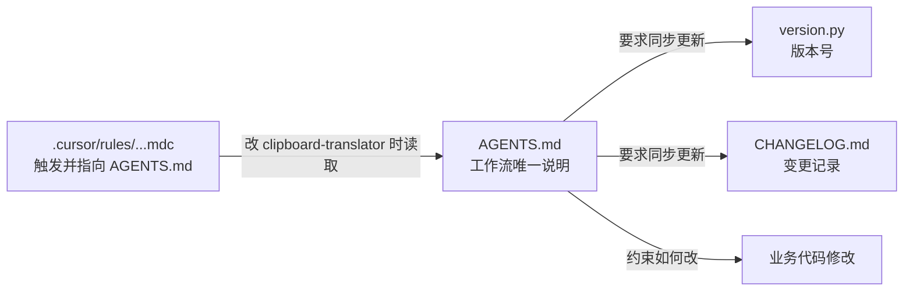

> 归档说明：本文件由 Cursor 计划 `agent_docs_naming_9624de7e.plan.md` 入库。状态见文首 YAML；版本对照见 [`VERSION-PLANS.md`](../../VERSION-PLANS.md)。
# clipboard-translator 工作流文档命名与整合

## 推荐文件名

**采用 [`clipboard-translator/AGENTS.md`](clipboard-translator/AGENTS.md)**

| 候选 | 评价 |
|------|------|
| **`AGENTS.md`** | **首选**。Cursor 官方常见约定（create-rule 技能也提到），表示「给 Agent 的项目说明」，语义清晰，不与云部署混淆 |
| `agent.md` | 不推荐：大小写不统一，生态里几乎都用 `AGENTS.md` |
| `cloud.md` | 不推荐：容易被理解成云端/部署配置，与「改代码 + 升版 + 写日志」无关 |
| `CONTRIBUTING.md` | 可作人类贡献指南的别名，但对本仓库「主要给 Agent 执行」的场景不如 `AGENTS.md` 贴切 |
| `.cursor/rules/*.mdc` | 适合做**强制触发**的短规则，不适合承载完整工作流长文 |

结论：项目根下放可读的长说明用 **`AGENTS.md`**；需要 Cursor 自动挂载时，用一条短 `.mdc` 指向它。

## 文件职责划分

- **`AGENTS.md`**：怎么改代码、怎么写说明、何时升版、怎么写日志（唯一叙述源）
- **`version.py` / `CHANGELOG.md`**：运行时版本与对外变更记录（保持现状，不把日志写进 AGENTS.md）
- **短规则 `.mdc`**：只负责「匹配 `clipboard-translator/**` 时必须遵循 AGENTS.md」，避免两处重复维护长文

## `AGENTS.md` 建议结构（精简）

1. **范围**：本文件约束 `clipboard-translator/` 内的 Agent 改动
2. **改代码**：小步、贴合现有风格；用户可见行为变更需可验证
3. **写说明**：用户向说明写在 `README.md`；过程/方案可写 `PLAN-*.md`；不要把变更史写进 README
4. **升版与日志**：复用现有 SemVer 与 CHANGELOG 约定（从当前 [`clipboard-translator-versioning.mdc`](.cursor/rules/clipboard-translator-versioning.mdc) 迁入）
5. **改完自检**：升版、写日志、托盘/UI 版本一致

## 落地时的文件动作（确认本计划后再做）

1. 新建 [`clipboard-translator/AGENTS.md`](clipboard-translator/AGENTS.md)，迁入并略扩展现有版本规则内容
2. 将 [`.cursor/rules/clipboard-translator-versioning.mdc`](.cursor/rules/clipboard-translator-versioning.mdc) 收成短规则：说明「遵循 `clipboard-translator/AGENTS.md`」，避免双份长文
3. 在 [`clipboard-translator/README.md`](clipboard-translator/README.md) 加一行链接到 `AGENTS.md`（给人类/Agent 导航）
4. 本次若只动文档/规则、不改运行时行为：按现有约定**不升版**；若顺带改了 `main.py` 等运行时代码，再按 AGENTS 规则升 patch

## 不采用的命名

- 不用 `cloud.md` / `agent.md` / `RULES.md` 作为主文件名
- 不把完整工作流只放在 workspace 规则里而项目目录下没有可读入口（子仓库单独打开时会丢上下文）
