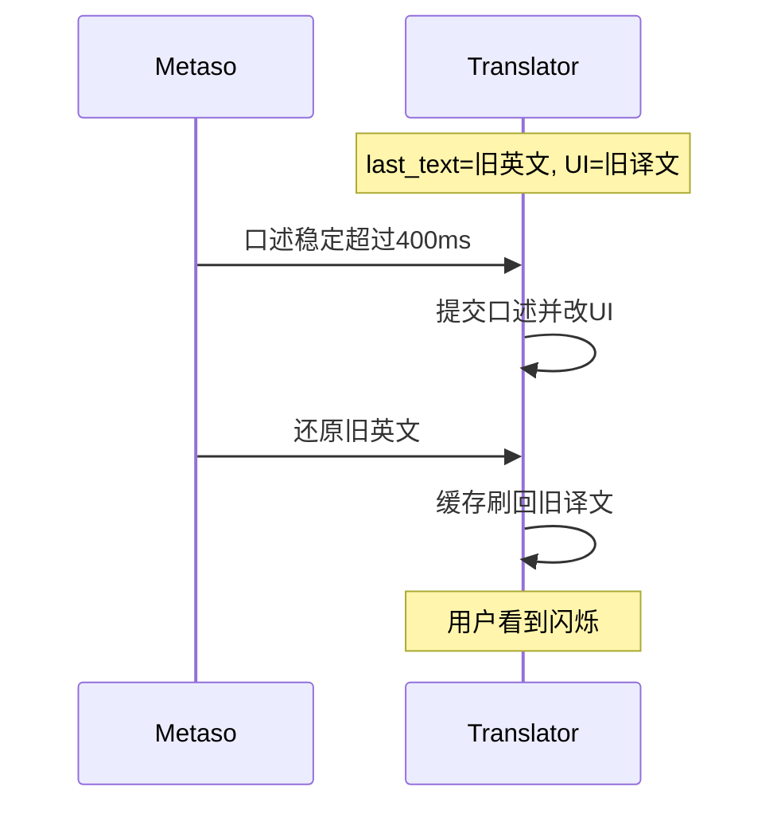

> 归档说明：本文件由 Cursor 计划 `定位与语音误触_84bd8127.plan.md` 入库。状态见文首 YAML；版本对照见 [`VERSION-PLANS.md`](../../VERSION-PLANS.md)。
# 修复窗口居中 + 语音剪贴板闪烁

## 你看到的现象分别是什么

### 1. 每次打开在屏幕正中间

**上次 0.1.1 竞态修复没有改定位逻辑。** 实际改动只有：

- [`main.py`](c:\my_data\code\cursor\clipboard-translator\main.py)：防抖、`_apply_clipboard_text`、复制忽略、剪贴板用 `show_raised()`
- [`window.py`](c:\my_data\code\cursor\clipboard-translator\window.py)：新增 `show_raised()`（`show`+`raise_`，不 `activateWindow`）

仓库里**从来没有**把窗口挪到右下角的代码，只有 `resize(440, 400)` 后直接 `show()`，Windows/Qt 默认就是偏中间。[`AGENTS.md`](c:\my_data\code\cursor\clipboard-translator\AGENTS.md) 示例 changelog 写过「锚定右下角」，但 Initial commit 的 `window.py` 里从未实现。另外置顶切换会 `setWindowFlags` 再 `show()`，原生窗口重建后位置也容易被打回默认居中。

### 2. 语音先闪一下口述，再刷回旧译文

当前流程：剪贴板稳定 **400ms** 后若内容 ≠ `_last_text` 就立刻 `set_source` / 清空译文 / 开翻译。

秘塔若把口述在剪贴板里停 **>400ms** 再还原：

1. 定时器先提交口述 → UI 短暂变成口述（你看到的「读取到」）
2. 再还原旧英文 → 缓存命中刷回旧译文

结束状态往往「碰巧对了」，但中间闪烁、还可能白打一次 LLM——这正是你说「逻辑不太对」的地方。根因是：**防抖只保证「稳定了一小段」，不能区分「真要译」和「语音工具临时占用」。**

## 修复方案

### A. 启动/显示锚定右下角 + 置顶不丢位置

在 [`window.py`](c:\my_data\code\cursor\clipboard-translator\window.py)：

- 新增 `_anchor_bottom_right()`：按当前屏 `availableGeometry()`，边距 16px，移到右下（避开任务栏）
- 首次 `showEvent` 时锚定一次；若用户拖过标题栏则设 `_user_placed=True`，之后不再强行拉回
- `_on_pin_toggled`：`setWindowFlags` 前记下 `geometry()`，`show()` 后立刻 `setGeometry` 恢复，避免置顶切换居中

### B. 剪贴板「确认窗口」：还原则绝不改 UI

在 [`main.py`](c:\my_data\code\cursor\clipboard-translator\main.py) 把单段 400ms settle 改成两段、且**两段都结束前不碰原文/译文**：

1. **Settle（约 350ms）**：内容需稳定；期间只更新 pending
2. **Confirm（约 800ms）**：若稳定内容 ≠ `_last_text`，进入确认；确认期内若剪贴板变回 `_last_text`（或空）→ **直接丢弃，零 UI 变更、不请求 LLM**；确认期满且仍是新内容 → 再调用现有 `_apply_clipboard_text`

正常复制新文本总延迟约 1.1s（可接受）；秘塔「写入→还原」只要落在确认窗内，界面完全不动。

保留现有：缓存命中也 `invalidate`、复制译文内容/时间窗忽略、剪贴板路径用 `show_raised()`。

### C. 版本与说明

- `version.py`：`0.1.1` → `0.1.2`
- `CHANGELOG.md`：Fixed 启动右下角锚定/置顶保位置；Fixed 语音临时改剪贴板在确认窗内还原时不更新 UI、不请求模型
- `README.md`：一句说明复制后约 1s 内确认再译；语音误触已抑制

## 验收

1. 冷启动（或托盘重新显示）：窗口在可用区域右下角，不在屏幕正中  
2. 拖到别处后再显示：不强制弹回右下角；切换置顶不跳回正中  
3. 秘塔说一段（写剪贴板再还原）：原文/译文全程不变，无闪烁、无新的「翻译中」  
4. 普通复制新英文：约 1s 后正常翻译  
5. 复制译文：不把自己再当原文译一遍  
