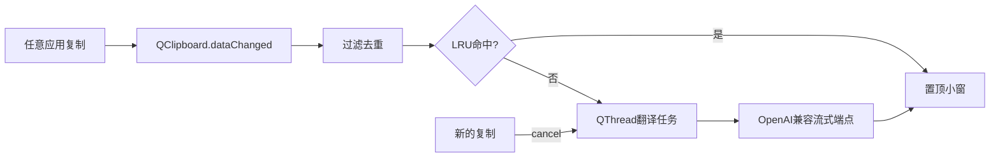

> 归档说明：本文件由 Cursor 计划 `剪切板_llm_翻译_a4ee6753.plan.md` 入库。状态见文首 YAML；版本对照见 [`VERSION-PLANS.md`](../../VERSION-PLANS.md)。
# Windows 剪切板 LLM 翻译器（PySide6 原生小窗）

## 目标

复制任意来源文本（浏览器 / 桌面软件 / Steam 等）→ 自动读剪切板 → 调你自己的 LLM 端点流式翻译 → **Win 内置顶小窗直接出结果**。不为翻译去打开网页。

## 技术选型（已定）

- **栈**：Python 3.11+ + **PySide6**（投入产出比最高，整体约 200 行量级核心逻辑）
- **剪贴板**：`QClipboard.dataChanged`（Qt 已封装 Win32 `AddClipboardFormatListener` / `WM_CLIPBOARDUPDATE`，事件驱动，空闲 CPU≈0，不轮询）
- **翻译**：OpenAI 兼容 Chat Completions，`stream=true`；接口抽象一层，端点可换
- **UI**：PySide6 置顶小窗（原文 + 流式译文 + 状态），系统托盘常驻
- **不做**：FastAPI / 本地网页 / 浏览器跳转

## 速度三个杠杆（体验核心）

1. **流式输出**：首 token 立刻上屏，不等整段译完
2. **`requests.Session` 长连接预热**：启动时或首次请求后复用连接，省掉每次 TLS 握手 100–300ms
3. **LRU 缓存 + 任务抢占**：相同文本直接回缓存（0ms）；连续复制时取消旧任务，只算最新一条

## 配置

本地 [`config.toml`](clipboard-translator/config.toml)（gitignore），示例见 `config.example.toml`：

```toml
[llm]
base_url = "https://your-endpoint/v1"
api_key = "sk-xxx"
model = "your-model"
timeout_s = 30

[app]
target_lang = "zh"
min_chars = 2
max_chars = 8000
always_on_top = true
cache_size = 128
```

端点形态：

```http
POST {base_url}/chat/completions
Authorization: Bearer {api_key}
{ "model": "...", "messages": [...], "stream": true }
```

## 架构



## 项目结构

新建 [`clipboard-translator/`](clipboard-translator/)：

- `main.py` — `QApplication`、托盘、剪贴板信号、启动小窗
- `window.py` — 置顶小窗：原文区、译文区（流式追加）、状态栏、复制译文按钮
- `translator.py` — `Translator` 抽象 + `OpenAICompatTranslator`（Session、stream、cancel）
- `cache.py` — 简单 LRU（原文+目标语言 → 译文）
- `config.py` — 读 `config.toml`
- `requirements.txt` — `PySide6`、`requests`、`tomli`（若需 py&lt;3.11）等
- `config.example.toml`、`README.md`

可合并文件以保持精简；不强制拆很细。

## 核心行为

1. **监听**：`QGuiApplication.clipboard().dataChanged` → 读 `text()`；忽略自己写入剪切板（复制译文按钮）造成的回环
2. **过滤**：空 / 纯空白 / 与上次相同 / 过短过长 / 非文本忽略
3. **翻译**：system prompt：「只输出译文；自动识别源语言；译成目标语言」。工作线程里 stream，每块通过信号回主线程追加 UI
4. **抢占**：新文本到来 → `cancel` 当前请求（关闭 response / 设 flag）→ 开新任务；UI 清空旧流式片段
5. **缓存**：完整译文写入 LRU；再次复制同文直接填窗，不打 API
6. **小窗**：`Qt.WindowStaysOnTopHint`；复制时自动显示/唤起；托盘可暂停监听、显示/隐藏、退出
7. **错误**：401 / 超时 / 连接失败在状态栏红字显示，进程不崩

## UI 草图（单窗，不花哨）

- 标题：Clipboard Translator
- 上：原文（只读）
- 下：译文（流式增长）
- 底：状态（监听中 / 翻译中 / 缓存命中 / 错误）+「复制译文」

## 你需要准备的

- OpenAI 兼容端点的 `base_url` / `api_key` / `model`
- Python 3.11+

## 验收标准

- Chrome / 记事本 / Steam 复制后，**系统内置顶小窗**弹出并流式出译文，不打开浏览器
- 连续快速复制只显示最后一次，不串台
- 重复复制同一段走缓存，几乎瞬时
- 暂停监听后复制不触发；配置错误有明确提示
