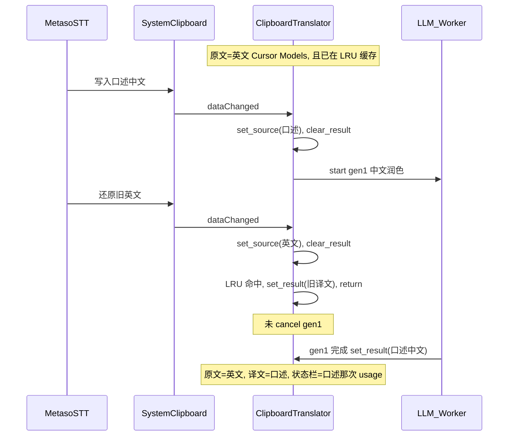

> 归档说明：本文件由 Cursor 计划 `修复剪贴板竞态_08088ea8.plan.md` 入库。状态见文首 YAML；版本对照见 [`VERSION-PLANS.md`](../../VERSION-PLANS.md)。
# 修复秘塔语音导致的原文/译文错位

## 原因（对照你的截图）

正常路径里，剪贴板变化会同时 `set_source` + `clear_result` 再翻译，**不会**只改译文。但 [`main.py`](c:\my_data\code\cursor\clipboard-translator\main.py) 的缓存命中分支有漏洞：

```175:194:c:\my_data\code\cursor\clipboard-translator\main.py
        cached = self._cache.get(cache_key)
        if cached is not None:
            self._window.set_result(cached)
            ...
            return   # ← 直接 return，没有 cancel 正在跑的 Worker

        self._start_translate(text)  # 只有这里会 _cancel_current()
```

与秘塔「写入识别结果 → 粘贴 → 还原旧剪贴板」叠加后：



这与截图一致：原文仍是 `Cursor Models...`，译文是打包发布那段口述，状态栏却是一次已完成的 LLM（`out 52` 也符合那段中文长度）。中文→中文时提示词会「轻度润色」，所以译文几乎等于口述内容。

次要加重因素（一并修）：

- 无防抖：语音工具连续改剪贴板会连触发
- `copy_translation` 的 `_ignore_clipboard` 同步清掉，`dataChanged` 常在下一拍才到，可能漏拦
- 每次剪贴板变化都 `activateWindow()`，容易抢焦点干扰秘塔粘贴

## 修复方案（默认做稳，不新增热键）

托盘已有「暂停监听」，本次以自动防误触为主。改动集中在 [`main.py`](c:\my_data\code\cursor\clipboard-translator\main.py)，必要时微调 [`README.md`](c:\my_data\code\cursor\clipboard-translator\README.md)。

### 1. 任何接受新剪贴板内容时都作废旧任务

抽出统一入口（例如 `_apply_clipboard_text`）：在更新原文/译文之前调用 `_cancel_current()` 并 `_generation += 1`（缓存命中也要 bump，让旧 `delta`/`finished` 全部失效）。缓存命中只展示缓存，不再让后台 Worker 写回 UI。

### 2. 剪贴板 settle 防抖（约 400ms）

- `dataChanged` 只更新 `_pending_text` 并重启单次 `QTimer`
- 定时器触发后再读剪贴板；若与 `_last_text` 相同则**整段忽略**（秘塔还原回上一条时，不应再翻译、不应改 UI）
- 仅当稳定内容与 `_last_text` 不同时，才 `set_source` / 翻译或走缓存

这样「口述写入 → 很快还原英文」在定时器触发时已是英文且等于 `_last_text`，整段误触消失。

### 3. 修复「复制译文」自触发

用「忽略与刚写入相同的文本」或「忽略随后 ~300ms 的变更」替代同步布尔 `_ignore_clipboard`，避免 `setText` 后 flag 已清、信号后到。

### 4. 剪贴板触发时不抢键盘焦点

剪贴板路径改为 `show()` + `raise_()`，**不** `activateWindow()`；托盘「显示窗口」仍可完整激活。减少秘塔 Ctrl+V 贴到本窗口的概率。

### 5. 版本与说明（按 AGENTS.md）

- [`version.py`](c:\my_data\code\cursor\clipboard-translator\version.py)：`0.1.0` → `0.1.1`
- [`CHANGELOG.md`](c:\my_data\code\cursor\clipboard-translator\CHANGELOG.md)：Fixed——缓存命中未取消旧翻译导致原文/译文错位；剪贴板防抖避免语音输入短暂改写；复制译文忽略竞态；监听时不抢焦点
- README 补一句：语音输入若改系统剪贴板可能误触；已做防抖，仍冲突可用托盘暂停监听

## 验收

1. 先复制一段英文并译完，再用秘塔说一段中文（会写剪贴板再还原）：原文/译文应保持刚才的英译结果，不应出现口述进译文、也不应多一次无关 LLM  
2. 正常复制新文本：约 400ms 内稳定后仍会自动翻译  
3. 点「复制译文」：不应立刻把译文再当原文翻译  
4. 翻译过程中剪贴板再次变化（含缓存命中旧文本）：旧流式结果不能写回 UI  
