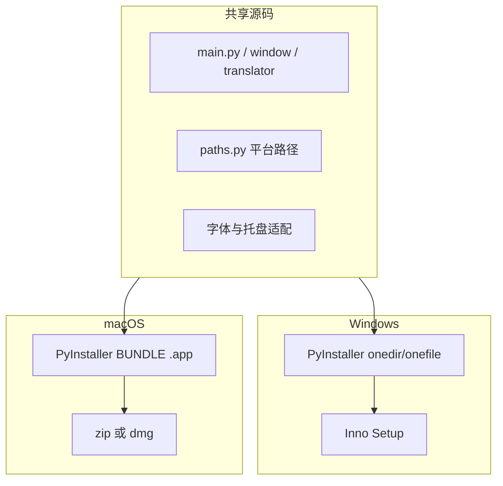

> 归档说明：本文件由 Cursor 计划 `跨平台_mac_windows_0264daee.plan.md` 入库。状态见文首 YAML；版本对照见 [`VERSION-PLANS.md`](../../VERSION-PLANS.md)。
# 跨平台（Windows + macOS）落地计划

## 结论

**能实现。** 当前运行时几乎没有 Win32 原生依赖（无 pywin32 / 全局热键），核心是 PySide6 + requests，源码级移植门槛低。真正要改的是：**冻结态用户目录写死 `%APPDATA%`、仅 `.ico`、打包/CI 全是 Windows**。不需要大重构拆架构；做「平台抽象 + 双端打包」即可。

默认范围：同一仓库源码双端可跑 + 产出未签名 macOS `.app`（zip/dmg）与现有 Windows Setup/portable。**Apple Developer ID 签名与公证**单独作为后续阶段（没有证书时 Gatekeeper 只能「右键打开」）。



## 现状要点

- 剪贴板已用 `QClipboard.dataChanged`（跨平台）
- 冻结态路径在 [`paths.py`](paths.py) 写死 Windows：

```22:32:paths.py
def user_data_dir() -> Path:
    if is_frozen():
        base = os.environ.get("APPDATA")
        if not base:
            base = str(Path.home() / "AppData" / "Roaming")
        path = Path(base) / APP_NAME
```

- 图标仅 [`assets/app.ico`](assets/app.ico)；打包见 [`clipboard_translator.spec`](clipboard_translator.spec)、[`scripts/build_windows.ps1`](scripts/build_windows.ps1)、[`.github/workflows/release-windows.yml`](.github/workflows/release-windows.yml)
- 字体多处写死 `Segoe UI`（`window.py` / `history.py` / `settings_dialog.py`）

## 实施方案（分阶段，小步）

### 阶段 1：运行时跨平台（必须，改动小）

1. **改 [`paths.py`](paths.py)**
   - `user_data_dir()` frozen 分支：
     - Windows: `%APPDATA%/ClipboardTranslator`（保持现状）
     - macOS: `~/Library/Application Support/ClipboardTranslator`
     - 其他：`~/.config/ClipboardTranslator`（顺带，成本低）
   - 开发态（非 frozen）继续用仓库根目录，行为不变
   - `app_icon_path()`：按平台优先 `app.icns` / `app.png` / `app.ico`（存在哪个用哪个）

2. **字体**
   - 抽一个小函数（可放 `paths.py` 旁或新建极薄 `platform_ui.py`）：Windows 用 Segoe UI，macOS 用系统 UI 字体（或不指定 family，交给 Qt）
   - 替换三处硬编码字体名

3. **托盘（[`main.py`](main.py)）**
   - 启动时检查 `QSystemTrayIcon.isSystemTrayAvailable()`
   - macOS：左键 `Trigger` 不可靠时，保证右键菜单可用；必要时 Trigger 也弹出菜单
   - 不引入 pyobjc，除非实机验证 Qt 托盘不可用

4. **版本与文档**
   - 按 [`AGENTS.md`](AGENTS.md)：升 minor（如 `0.5.0`），写 [`CHANGELOG.md`](CHANGELOG.md)，[`README.md`](README.md) 补充 Mac 数据目录与源码运行说明

### 阶段 2：macOS 打包（同仓双端产物）

1. **图标资产**
   - 扩展 [`scripts/generate_app_icon.py`](scripts/generate_app_icon.py)：从现有 SVG/PNG 生成 `assets/app.icns`（Mac 构建机用 `iconutil`；或在 CI `macos-latest` 生成）
   - Windows 继续用 `.ico`

2. **Spec**
   - 保留现有 Windows `EXE` + `COLLECT` + onefile
   - 在同一 spec 或 `clipboard_translator_macos.spec` 中增加 macOS `BUNDLE` → `Clipboard Translator.app`，`icon=app.icns`，`console=False`
   - 用 `sys.platform` 在 spec 内分支，避免两套完全分叉的维护成本（若分支过脏则拆第二个 spec）

3. **构建脚本**
   - 新增 `scripts/build_macos.sh`：装依赖 → PyInstaller → 产出 `.app`，再打成 `.zip`（优先；dmg 可选）
   - 保留 `build_windows.ps1` 不动

4. **CI**
   - 新增 `.github/workflows/release-macos.yml`：`macos-latest`，push `main` 时上传 macOS 资产到同一 `preview` / 正式 Release（与 Windows workflow 并列，或合并为 matrix；默认**并列两个 workflow**，减少改动 Windows 流水线风险）

### 阶段 3：签名与公证（后续，不阻塞阶段 1–2）

- 需要 Apple Developer Program、`codesign` + `notarytool` + entitlements
- 文档写清：未签名包的打开方式；有证书后再接 CI secrets
- macOS 自启（Login Items / LaunchAgent）也放此阶段；Windows 自启继续由 Inno 任务负责

## 明确不做（避免假「重构」）

- 不重写翻译/历史/设置架构
- 不引入 Win32 或 AppKit 专用库（除非托盘实机失败）
- 不做全局热键
- 不把无边框窗口改成原生 macOS titlebar（可后期 polish）

## 验证方式

- **Windows**：现有流程回归（源码 + 安装版路径仍在 `%APPDATA%\ClipboardTranslator`）
- **macOS**：源码 `python main.py`；确认配置落到 `~/Library/Application Support/ClipboardTranslator`；剪贴板翻译、托盘菜单、历史 JSONL；再测未签名 `.app`
- 本机若无 Mac：阶段 1 可先合入并由 `macos-latest` CI 编包；UI 实机需你在 Mac 上点一次

## 关键文件

| 文件 | 变更 |
|------|------|
| [`paths.py`](paths.py) | 平台用户目录 + 图标选择 |
| [`main.py`](main.py) / UI 文件 | 托盘与字体 |
| [`clipboard_translator.spec`](clipboard_translator.spec)（或 macos spec） | BUNDLE |
| `scripts/build_macos.sh`、`generate_app_icon.py` | Mac 构建与 icns |
| `.github/workflows/release-macos.yml` | CI |
| `version.py` / `CHANGELOG.md` / `README.md` | 升版与说明 |
