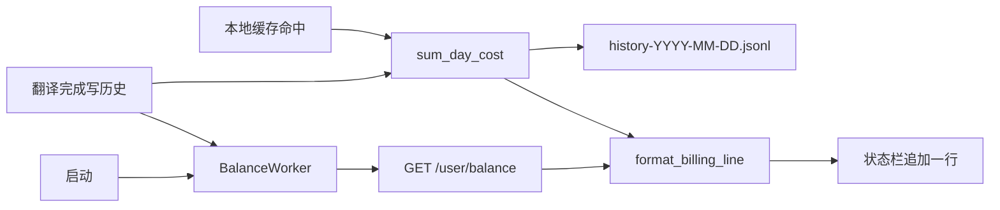

> 归档说明：本文件由 Cursor 计划 `deepseek_日计费展示_c2bb6fea.plan.md` 入库。状态见文首 YAML；版本对照见 [`VERSION-PLANS.md`](../../VERSION-PLANS.md)。
# DeepSeek 日计费展示（Windows / 本机）

## 目标

保留现有「单次翻译费用 + cache 节省」逻辑不变，额外展示：

- **今日已用**：本机今日翻译历史的 `cost_yuan` 合计
- **剩余金额**：DeepSeek `GET /user/balance` 的 `total_balance`（优先 CNY）
- **比例**：已用 : 剩余（约简整数比；剩余为 0 时单独文案）

示例（不必过细）：

```text
今日已用 0.12元 · 剩余 98.5元 · 约 1:821
```

展示位置：主窗底部状态栏**追加一行**（在现有 `format_status_lines` 结果之后），不新开对话框。

## 数据口径（已确认）

| 指标 | 来源 | 说明 |
|------|------|------|
| 今日已用 | 本机 [`history_store.py`](history_store.py) 当日 JSONL | 只含本应用本机估算；与用户「目前只有这款软件在用」一致 |
| 剩余 | DeepSeek 官方余额 API | 账户级实时余额 |
| 比例 | `used : remaining` | 本地已用 vs 账户剩余；跨机消耗本期不处理 |

远期 Mac / 多机：每台机器各自 `data_dir` 历史，**不会自动汇总**。以后若要多机一致，需另做历史同步或改用「余额差值」；本期不实现，只在 `PLAN-billing-balance.md` 记一笔。

## 架构



## 实现要点

### 1. 余额客户端

在 [`translator.py`](translator.py) 旁新增轻量模块（建议 `balance.py`，避免把计费 UI 塞进 translator）：

- `GET {base_url}/user/balance`，`Authorization: Bearer {api_key}`（复用现有 `LlmConfig`）
- 若 `base_url` 以 `/v1` 结尾则去掉后再拼 `/user/balance`（官方文档为 `https://api.deepseek.com/user/balance`）
- 解析 `balance_infos`：优先 `currency == "CNY"`，否则取第一条；`total_balance` 转 `float`
- 返回小 dataclass：`BalanceInfo(total_yuan, currency, is_available)`；失败抛/返回错误信息，由 UI 降级为「余额获取失败」

### 2. 今日已用

在 [`history_store.py`](history_store.py) 增加：

```python
def sum_day_cost(self, day: str | None = None) -> float:
    # 对 load_day(day) 的 cost_yuan 求和
```

跨日后自然切换到新文件，无需额外状态。

### 3. 文案与比例

扩展 [`pricing.py`](pricing.py)：

- `format_billing_line(used_yuan, remaining_yuan | None, *, error: str | None) -> str`
- 比例：用最大公约数约简到较小整数（如 `1:821`）；已用为 0 时显示 `0:1` 或「今日未消费」；余额失败时只显示今日已用 + 失败提示
- 金额继续用现有 `fmt_money`

### 4. UI 接线（[`main.py`](main.py) + [`window.py`](window.py)）

- `TranslatorWindow`：可加 `set_billing(text)` 独立 `QLabel`（状态栏下方或与 status 同列第二行区域），避免每次 `set_status("翻译中…")` 冲掉日计费；或 `set_status` 只改第一段、billing 常驻——**采用独立 `billing` 标签**更干净
- 启动后异步拉余额 + 汇总今日已用（`QThread` worker，模式对齐现有 `TranslateWorker`）
- 每次翻译成功 `append` 历史后：立即重算今日已用，并再拉一次余额（「实时」）
- 本地缓存命中：只刷新今日已用（费用为 0，余额可不强制刷新，为简单统一也可一起刷）
- 余额请求失败：不打断翻译；billing 行显示已用 +「余额暂不可用」

### 5. 文档与版本

- 新增 [`PLAN-billing-balance.md`](PLAN-billing-balance.md)：口径、刷新时机、Mac/多机远期备注
- [`version.py`](version.py)：`0.2.1` → `0.3.0`（新能力，minor）
- [`CHANGELOG.md`](CHANGELOG.md)：Added 条目（中文短句，用户可感知）
- [`README.md`](README.md)：若有「费用/状态栏」说明则补一句「今日已用与账户余额」；无则极短补充

## 非目标（本期不做）

- Mac 打包 / 跨机历史同步
- 设置页配置日预算、单价配置化
- 用余额差值推算日消费
- 改动既有单次 `estimate_cost` / 历史卡片费用展示

## 自检

- 启动可见 billing 行；翻译后已用增加、剩余更新
- 断网时翻译仍可用，billing 降级提示
- 版本与 CHANGELOG 已同步
