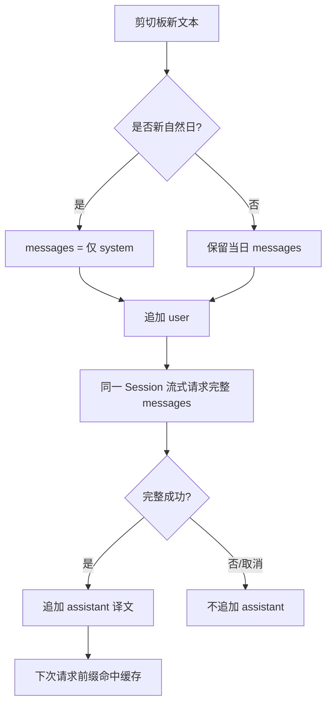

> 归档说明：本文件由 Cursor 计划 `deepseek_缓存对话改造_26836acb.plan.md` 入库。状态见文首 YAML；版本对照见 [`VERSION-PLANS.md`](../../VERSION-PLANS.md)。
# DeepSeek 缓存友好 messages 改造

## 问题

当前 `[translator.py](c:\my_data\code\cursor\clipboard-translator\translator.py)` 每次翻译都新建：

```python
"messages": [
  {"role": "system", "content": "You are a translation engine..."},
  {"role": "user", "content": text},
]
```

英文短 system、无历史 → DeepSeek 前缀几乎无法复用（且短于 64c时根本不落盘）。

## 目标机制




DeepSeek 规则（已定采用方式）：从第 0 token 起前缀完全一致才命中；多轮对话下一轮会命中上一轮上下文。因此 **只能追加，不能改历史、不能改 system**。

## 具体改动

### 1. 中文固定 system（写长、写死）

放在 `[translator.py](c:\my_data\code\cursor\clipboard-translator\translator.py)`，内容足够长（明显超过 64 tokens），且**全天不变**（`target_lang` 固化进 system，改语言视为新会话并重置）：

要点（中文）：

- 角色：专业翻译引擎
- 自动识别源语言 → 译成配置的目标语（默认简体中文）
- 只输出译文：无解释、无引号、无「译文：」前缀
- 保留专有名词/代码标识符/游戏黑话合理处理约定
- 内嵌 2～3 组固定 few-shot（user/assistant 也可写进 system 文本，或作为启动时写入 messages 的固定示范轮；**示范轮也算稳定前缀，启动后永不改动**）

选定实现：system 一段长中文说明 + **启动时写入 2 轮固定 few-shot**（4 条 message：u/a/u/a），之后真实翻译只往后再 append。这样前缀既长又稳定。

### 2. 进程内持久 `messages` + 一天一清

在 `OpenAICompatTranslator` 内维护：

- `_messages: list[dict]`
- `_day_key: str` — `date.today().isoformat()`（用本机本地时区自然日）
- `_ensure_fresh()`：若日期变了 → 重建 `[system] + few-shot`，丢掉旧对话
- 每次 `translate_stream`：
  1. `_ensure_fresh()`
  2. `messages.append({"role":"user","content": text})`
  3. 用**整份** `self._messages` 发请求（不再每次 new list）
  4. 成功收完流 → `append({"role":"assistant","content": result})`
  5. 取消/失败 → `pop` 刚才那条 user（保持 messages 可再次完整匹配前缀）

线程安全：现有翻译已在单 worker 线程串行（新任务会 cancel 旧任务）；对 `_messages` 加一把 `threading.Lock`，避免边界竞态。

### 3. 与现有 LRU 的关系

本地 LRU 仍保留（同文 0ms）。缓存未命中才走 LLM；走 LLM 时走「当日多轮 messages」。两者不冲突。

### 4. 状态栏可见缓存命中（便于你验收）

流式结束后若 SSE 有 `usage`（DeepSeek 会给），解析 `prompt_cache_hit_tokens` / `prompt_cache_miss_tokens`，经现有信号把状态改成类似：`完成 · cache hit 1.2k / miss 80`。无 usage 则只显示 `完成`。

### 5. 安全阀（仍服从一天一清）

若单日轮次过多导致上下文过大（按字符粗估，例如 messages 总字符 > 80k），从 few-shot **之后**删掉最早的若干完整 user/assistant 对，**绝不改 system 与 few-shot**。这会牺牲一段前缀命中，但避免撑爆上下文；正常一天剪切板量通常碰不到。

## 主要改文件

- `[translator.py](c:\my_data\code\cursor\clipboard-translator\translator.py)` — system/few-shot、messages 生命周期、取消回滚、usage 解析
- `[main.py](c:\my_data\code\cursor\clipboard-translator\main.py)` — 把 cache hit 信息传到状态栏（`finished` 信号可带可选 usage 字符串，或另加字段）

## 验收

1. 连续复制多段不同文本：第二次及以后请求应出现 cache hit（状态栏或抓包看 usage）
2. 改 system/换目标语言后首包 miss 属正常
3. 跨自然日（或把系统日期拨到次日再请求）：messages 回到仅 system+few-shot
4. 中途取消复制：失败/取消不留下残缺 assistant；下一次前缀仍连续

