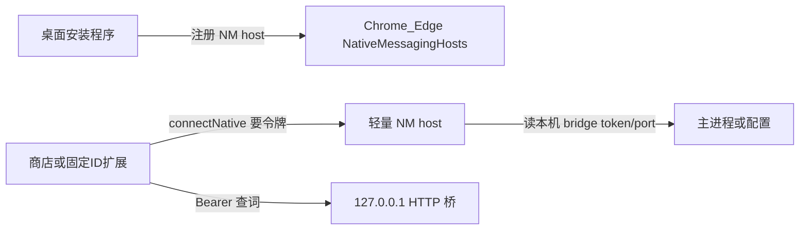

> 归档说明：0.9.0 落地分发引导与 Native Messaging；0.9.1 改为仅 Edge Add-ons。上架见 [`../../guides/extension-store-publish.md`](../../guides/extension-store-publish.md)。

# 扩展分发与自动配对

## 调研结论（最佳实践）

### 给别人用时怎么打包
- **桌面端**：Windows `Setup.exe` / `portable.exe` + NmHost，macOS `.app` zip；配置落在 `%APPDATA%\ClipboardTranslator`。
- **扩展端「优雅加载」排序**（从优到差）：
  1. **Edge Add-ons「未公开 / Hidden」**（正式路径；不上架 Chrome Web Store）
  2. **Release 附带 `extension.zip` + 安装向导打开引导页**（审核过渡期）
  3. **Edge 开发人员模式加载解压目录**（仅开发）
  4. **企业策略强制安装 / 自托管 CRX**（不作为个人主路径）

### 桌面 + 扩展如何自动连接

- **Native Messaging**：零点击交令牌 / 端口。
- **localhost HTTP**：高频查词 / 划词翻译（[`browser_bridge.py`](../../../browser_bridge.py)）。
- **短码配对**：NM 失败时的兜底。

## 0.9.0 已落地

| 阶段 | 内容 |
|------|------|
| A | `distribution.py`、引导页、首次运行/设置/托盘/Inno 打开引导；默认启用 bridge |
| B | 扩展公钥固定 ID、`onInstalled` 开引导页；商店上架清单文档（人工审核） |
| C | `ClipboardTranslatorNmHost`、HKCU 注册、扩展 `sendNativeMessage` |
| D | popup 状态、托盘未配对提示、单测、升版 0.9.0 |

## 上架后运维

替换 `EDGE_ADDON_URL`：见 [`../../guides/extension-store-publish.md`](../../guides/extension-store-publish.md)。
