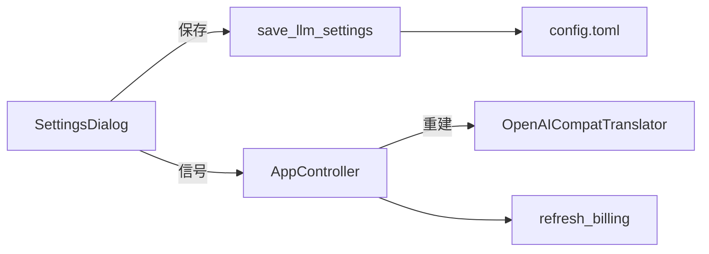

> 归档说明：本文件由 Cursor 计划 `图标与llm设置_fb486d43.plan.md` 入库。状态见文首 YAML；版本对照见 [`VERSION-PLANS.md`](../../VERSION-PLANS.md)。
# 剪贴板图标 + 设置中配置大模型 + 打包

## 目标

- 桌面快捷方式 / exe、系统托盘共用同一简洁剪贴板图标
- 设置对话框可改 `base_url`、`api_key`、`model`，保存后立即生效（无需手改 toml 后重启）
- 本地执行 `scripts/build_windows.ps1` 产出便携包与安装包

## 1. 图标：查找、下载、放入 assets

**选型（已定）**：沿用仓库现有 Lucide（ISC）风格，采用官方 [clipboard](https://lucide.dev/icons/clipboard) 轮廓图标。现有标题栏图标已是 Lucide（见 [`assets/icons/settings.svg`](assets/icons/settings.svg) 头注释），风格一致。

**落盘文件**

| 文件 | 用途 |
|------|------|
| [`assets/icons/clipboard.svg`](assets/icons/clipboard.svg) | 源 SVG（与 pin/settings 同目录） |
| [`assets/app.ico`](assets/app.ico) | 多尺寸 ICO（16/32/48/64/256），供 PyInstaller / 桌面快捷方式 |
| （可选同源）托盘直接加载 `app.ico` | 避免再维护一份 PNG |

**生成方式（实现时执行）**

1. 从 Lucide 官方仓库拉取 `clipboard.svg`（raw：`https://raw.githubusercontent.com/lucide-icons/lucide/main/icons/clipboard.svg`）
2. 用 Pillow + 现有 Qt/`cairosvg` 或简易脚本：在 `#3c78d8` 圆角底上绘制白色剪贴板线条（小尺寸更清晰，且与当前托盘蓝底一致），导出多尺寸并合成 `assets/app.ico`
3. 将原始 SVG 保留在 `assets/icons/`，便于后续改色

不改动用户 `config.toml`；不把本机路径写进文档。

## 2. 打包与运行时统一使用该图标

**PyInstaller** — [`clipboard_translator.spec`](clipboard_translator.spec)

- `datas` 增加 `assets/app.ico`（或整个 `assets`）
- 两个 `EXE(...)`（onedir / onefile）均加：`icon=str(root / "assets" / "app.ico")`
- Inno Setup [`installer/setup.iss`](installer/setup.iss) 的桌面快捷方式默认跟随 exe 图标，一般无需改；可选加 `SetupIconFile` 让安装向导一致

**运行时** — [`main.py`](main.py)

- 删除手绘「译」字的 `_make_tray_icon()`，改为从 `resource_dir()/assets/app.ico` 加载 `QIcon`
- `QApplication.setWindowIcon(...)` + 托盘 `QSystemTrayIcon(icon)` 使用同一路径
- 加载失败时保留极简回退（避免启动崩溃）

## 3. 设置中配置 API URL / Key / 模型名

保持现有 TOML 字段不变（不拆 host/port），仅补齐 UI 与写回。



**[`settings_dialog.py`](settings_dialog.py)**

- 扩大对话框，在字号上方增加：
  - API URL（`QLineEdit`，对应 `llm.base_url`）
  - API Key（`QLineEdit`，`EchoMode.Password`，可加显示切换）
  - 模型名（`QLineEdit`）
- 构造函数接收当前 `LlmConfig` + `font_size`
- 确定时校验 URL、模型非空；发出字号信号，并通过返回值或新信号带出 LLM 三项

**[`config.py`](config.py)**

- 新增 `save_llm_settings(base_url, api_key, model, path=...)`：与 `save_font_size` 同样用正则/段落写回，保留文件中注释与其它键（`timeout_s`、`thinking` 等）
- 不改 `LlmConfig` 字段定义

**[`main.py`](main.py) `AppController`**

- `open_settings` 传入当前 `self._cfg.llm` 与字号
- 保存成功后：更新 `self._cfg` 中的 llm（或 `dataclasses.replace`）、`self._translator = OpenAICompatTranslator(...)`、必要时 `warm_up()`、清空或保留缓存（保留缓存即可）、`refresh_billing()`
- 进行中的翻译：递增 `_generation` 取消旧 worker，避免用旧端点回写结果

## 4. 文档与版本

按 [`AGENTS.md`](AGENTS.md)：

- [`version.py`](version.py)：`0.3.3` → **`0.4.0`**（新设置项 + 图标，minor）
- [`CHANGELOG.md`](CHANGELOG.md)：Added 设置可配 API；Changed 应用/托盘图标为剪贴板样式
- [`README.md`](README.md)：设置一节补一句「可在设置中填写 API URL / Key / 模型」，无需长篇方案

## 5. 本地打包

实现并自检后执行：

```powershell
.\scripts\build_windows.ps1
```

产出预期：

- `dist/portable/ClipboardTranslator-0.4.0-portable.exe`（带新图标）
- `dist/app\`（Inno 源）
- 若本机有 Inno Setup：`dist/ClipboardTranslator-0.4.0-Setup.exe`（桌面快捷方式用 exe 图标）

打包前结束已在跑的 `main.py`；打包后可用安装包或 portable 目视确认托盘与快捷方式图标。

## 主要改动文件

- 新增：`assets/app.ico`、`assets/icons/clipboard.svg`（及生成脚本若需要可放 `scripts/`，一次性用完也可不入库）
- 修改：`clipboard_translator.spec`、`main.py`、`settings_dialog.py`、`config.py`、`version.py`、`CHANGELOG.md`、`README.md`
- 可选：`installer/setup.iss`（`SetupIconFile`）
