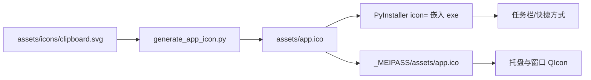
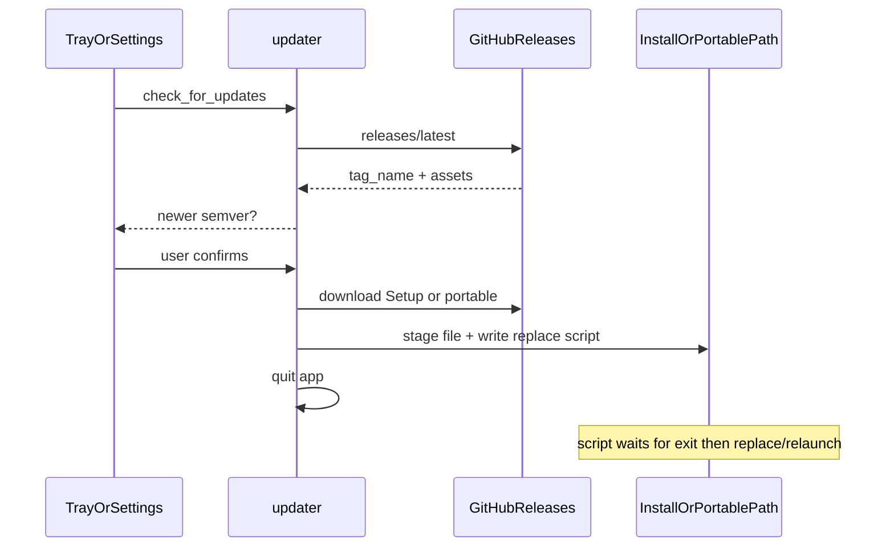

> 归档说明：本文件由 Cursor 计划 `图标排查与热更新_3593db9f.plan.md` 入库。状态见文首 YAML；版本对照见 [`VERSION-PLANS.md`](../../VERSION-PLANS.md)。
# 任务栏图标不更新排查 + 应用内热更新

## 一、底部栏（任务栏）图片为何云端安装后不变

这里的「底部栏图片」对应 **Windows 任务栏 / 开始菜单快捷方式图标**（以及托盘用的同一套 `app.ico`）。

### 资源链路

- 运行时：[`paths.app_icon_path()`](paths.py) → frozen 时从 `_MEIPASS/assets/app.ico` 加载（[`main._load_app_icon`](main.py)）
- 任务栏/快捷方式：主要看 **exe 内嵌图标**（[`clipboard_translator.spec`](clipboard_translator.spec) 的 `icon=`）+ **Explorer 图标缓存**
- 安装版目录：`%LOCALAPPDATA%\Programs\ClipboardTranslator`（[`installer/setup.iss`](installer/setup.iss)），不是 Program Files

### 根因（按概率）

1. **Windows 图标缓存（最常见）**  
   安装路径与 Inno `AppId` 固定不变时，覆盖安装后任务栏/快捷方式仍显示旧图；托盘有时已是新图，造成「只有底部栏没变」。
2. **Windows CI 不重新生成 ico**  
   [`.github/workflows/release-macos.yml`](.github/workflows/release-macos.yml) 会跑 `generate_app_icon.py`，**Windows CI 不会**；若只改了 SVG / `app-icon-fluent.png` 却未提交新的 [`assets/app.ico`](assets/app.ico)，云端 Windows 包仍是旧图标。`app-icon-fluent.png` **未被任何 spec 引用**。
3. **同版本只刷 preview**  
   未升 `version.py` 时，正式 `vX.Y.Z` 不会重发；若仍下载旧正式 Setup，图标不会变。

### 图标侧将做的修复

- Windows CI（[`release-windows.yml`](.github/workflows/release-windows.yml)）与本地 [`scripts/build_windows.ps1`](scripts/build_windows.ps1) 在打包前执行 `python scripts/generate_app_icon.py`，与 macOS 对齐，避免「源 SVG 新、ico 旧」。
- README 简短补充：覆盖安装后任务栏仍旧图时，重启资源管理器或重钉快捷方式（图标缓存）。
- 不引入应用内「单独换任务栏图」逻辑——图标随新包一起更新。

---

## 二、检查更新 + 覆盖后重启（默认方案）

**默认约定（已选定）：**

| 项 | 选择 |
|----|------|
| 通道 | 仅正式版 `GET /repos/{owner}/{repo}/releases/latest`（忽略 `preview`） |
| 形态 | 自动识别安装版 / 便携版，下载对应产物 |
| 交互 | 托盘/设置入口「检查更新」→ 有新版本则弹窗确认 → 下载进度 → 覆盖 → **退出并拉起新进程** |
| 平台 | 本阶段只做 **Windows**（你提到 EXE）；macOS 仅预留接口或文案「请至 Release 页下载」 |
| 生效方式 | 非进程内热替换（PyInstaller 做不到）；下载覆盖后自动重启即「立即生效」 |

### 流程

### 覆盖策略

- **便携版**（`sys.frozen` 且 exe 旁无 Inno 卸载信息 / 或单文件运行）：下载 `ClipboardTranslator-{ver}-portable.exe` → 存为临时文件 → 退出后用短生命周期的 `.cmd`/辅助进程：等待旧 PID 结束 → 覆盖原 exe → `start` 新进程。
- **安装版**（默认装在 `%LOCALAPPDATA%\Programs\ClipboardTranslator`）：下载 `ClipboardTranslator-{ver}-Setup.exe` → 退出后静默执行  
  `Setup.exe /VERYSILENT /NORESTART /SUPPRESSMSGBOXES`  
  （Inno 已有 `CloseApplications=yes`；由更新脚本在安装结束后再启动 `{app}\ClipboardTranslator.exe`）。

版本比较：本地 [`version.__version__`](version.py) vs release 的 `tag_name`（去掉 `v`）做 SemVer；不新则提示已是最新。

### 主要新增/改动文件

| 文件 | 职责 |
|------|------|
| 新建 [`updater.py`](updater.py) | 查 GitHub API、SemVer 比较、下载、识别安装形态、生成替换/静默安装脚本并重启 |
| [`main.py`](main.py) | 托盘菜单增加「检查更新」；接线到 updater（后台线程 + 信号回 UI） |
| [`settings_dialog.py`](settings_dialog.py) | 设置页增加「检查更新」按钮（与托盘同一逻辑） |
| [`version.py`](version.py) + [`CHANGELOG.md`](CHANGELOG.md) | minor 升版（如 `0.7.0`）并写清用户可见行为 |
| [`README.md`](README.md) | 检查更新用法；图标缓存说明 |
| [`PLAN-updater.md`](PLAN-updater.md) | 设计与限制（签名/SmartScreen、无法进程内热替换） |
| CI / [`build_windows.ps1`](scripts/build_windows.ps1) | 打包前生成 `app.ico` |

仓库公开，匿名访问 Releases API 即可；请求带合理 `User-Agent`。当前 CI **无 checksum 文件**，本阶段用 GitHub HTTPS + 资源大小校验；不引入私有 token。

### 明确不做

- 不跟踪 `preview` 自动更新（避免每 push 打扰）
- 不做无确认的完全静默强制更新
- 不做 macOS 自动覆盖（本阶段）
- 不手打 git tag；升版后 push `main` 由现有 CI 发正式包

### 验证

- 改 SVG 后本地跑 `generate_app_icon.py` + 打包，确认 exe 内嵌图标与托盘一致
- 模拟低版本：将运行中的 `__version__` 对比指向更高 tag（或临时改本地版本号）触发检查 → 确认下载、覆盖、重启后版本与图标正确
- 安装版与便携版各走一遍；取消更新不破坏现有安装
