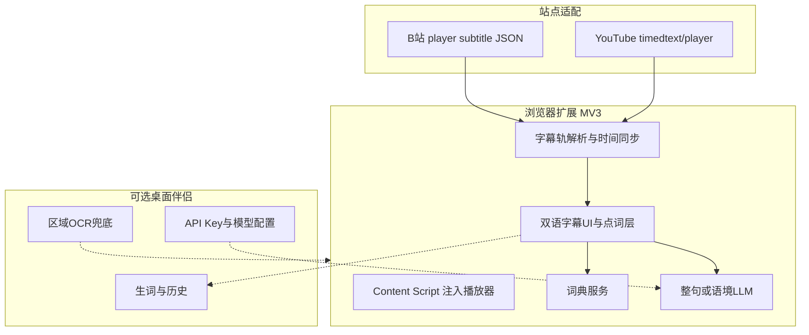

> 归档说明：本文件由 Cursor 计划 `视频字幕抽取翻译_454776ca.plan.md` 入库。状态见文首 YAML；版本对照见 [`VERSION-PLANS.md`](../../VERSION-PLANS.md)。
> 现行未做清单见 [`todo/immersive-subtitles.md`](../../todo/immersive-subtitles.md)。

# 沉浸式字幕插件：向 Language Reactor 进化

## 你描述的插件是什么

高度吻合 **[Language Reactor](https://chromewebstore.google.com/detail/language-reactor/hoombieeljmmljlkjmnheibnpciblicm)**（前身 Language Learning with Netflix / YouTube）。同类还有 Dualsub、部分「双语字幕」扩展。

核心循环（你要的）：

1. 从站点**字幕轨**取原文（不是截图 OCR）
2. 把字幕**融进播放器**（双语叠字 + 侧栏逐句）
3. **悬停/点击单词** → 视频**暂停在当前秒** → 弹出释义
4. 可选：复读本句、句末自动暂停、整句译文

这比「剪贴板翻译 / 飞书截图」更贴合「看英文课少打断」。

---

## 产品定位（进化方向）

| | Language Reactor | 我们要做的 |
|--|------------------|------------|
| 主场 | YouTube + Netflix | **YouTube + B站**（课多用这两站） |
| 查词 | 自带词典 / Pro AI | 词典优先 + **你自己的 LLM**（语境释义可更贴课程） |
| 整句 | 机翻/站点译 | 复用现有 OpenAI 兼容配置与缓存思路 |
| 桌面 | 无 | 可选伴侣：配置、生词本、硬字幕 OCR |
| 目标 | 泛语言学习 | **看纯英文课程时秒懂生词/难句** |

**重心：浏览器扩展是主产品**；现有 [clipboard-translator](main.py) 降为伴侣，不再承担「看课主路径」。

---

## 目标体验（成功标准）

看课中途：

1. 不切 App、不截图  
2. 字幕始终可读（原文 + 可选中文）  
3. 点生词 → **立刻暂停** → 浮层出释义（&lt;1s）  
4. 关闭浮层 / 再点播放 → 从同一秒继续  
5. 难句可看整句译文或按快捷键复读本句  

交互预算：查一个词 ≈ **一次点击**，目光不离开播放器区域。

```mermaid
flowchart LR
  track[字幕轨当前句] --> render[播放器内双语字幕]
  render --> click[点击单词]
  click --> pause[pause视频]
  click --> dict[词典或LLM释义]
  dict --> popup[词上浮层]
  popup --> resume[继续播放]
```

---

## 顶层架构



### 模块职责

1. **站点适配层**：只负责「拿到带时间轴的 cue 列表 + 当前播放时间」  
2. **字幕 UI 层**：替换/覆盖原生 CC，渲染可点击 token，点击时 `video.pause()`  
3. **理解层**：单词→词典；短语/整句/「这个词在本句什么意思」→ LLM（可开关）  
4. **伴侣层（后期）**：配置同步、生词本、无轨 OCR  

---

## MVP 范围（先做透 YouTube）

### 必须有（Phase 1）

- 检测有 CC/自动字幕的 YouTube 视频并拉取轨  
- 播放器底部（或紧贴视频）显示**可点击的英文字幕**  
- 可选第二行中文（首版可用轻量翻译：自有 LLM 或先接免费 MT，需在实现时定一种默认）  
- **点击单词 → pause + 弹层释义**（词典；无结果再问 LLM）  
- 无字幕轨时明确提示（不静默失败）

### 紧接着（Phase 2–3）

- 整句译文（LLM + 缓存，避免每句都打满价模型）  
- 快捷键：复读当前句、上一句/下一句、开关双语、开关「点词自动暂停」  
- 侧栏逐句列表（点行跳转，对标 LR）

### 然后（Phase 4）

- B站：登录态拉字幕 JSON，同一套 UI/点词逻辑  

### 伴侣（Phase 5）

- 桌面端读取同一套 LLM 配置；扩展设置可导入  
- 生词同步；硬字幕场景才用区域 OCR  

### 明确首版不做

- Netflix 全站适配  
- 完整 Anki/PhrasePump 生态  
- 浏览器实时截帧 OCR  
- 重做桌面「截图查词」当主路径  

---

## 关键技术决策（已选定默认）

- **扩展形态**：Chrome/Edge MV3；YouTube SPA 用 content script + 播放器钩子  
- **分词**：英文按词/标点切 token；点击单位是词，不是整句（整句另开按钮/快捷键）  
- **暂停策略**：点击词强制 `pause`；悬停是否暂停做成设置，默认悬停只出简释、点击才暂停（减少误触）——若你更想「悬停也暂停」，实现前可再调  
- **翻译**：  
  - 词：离线/免费词典优先（如ECDICT类或在线词典 API）  
  - 句：用户已有 DeepSeek/OpenAI 兼容端点  
- **与现有仓库关系**：新建 `browser-extension/`（或独立仓库）；桌面项目保持可发布；共享设计写在 `PLAN-immersive-subs.md`  
- **成本**：字幕轨零 OCR；词典挡掉大部分词查询；LLM 仅整句/语境，加重度缓存  

---

## 实施阶段

1. **YouTube MVP**：抽轨 + 可点词字幕 + 暂停 + 词典弹层  
2. **整句 LLM + 缓存**  
3. **学习向播放控制**（复读/跳句/可选句末暂停）  
4. **B站适配**  
5. **桌面伴侣与 OCR 兜底**  

每阶段都应能自己用看课验证：斯坦福课这类有 CC 的视频是黄金测试片。

---

## 风险

- YouTube DOM/字幕接口变更 → 适配层要隔离好  
- B站 AI 字幕常需登录 Cookie  
- 与站点 TOS/自动化政策：仅读取用户已可看的字幕轨，不做批量爬库  
- Language Reactor 已很强：差异化放在 **B站 + 自有 LLM 语境 + 课程向轻量**，不追求一比一抄全功能  

---

## 和上一版方案的关系

- 「剪贴板 / 飞书式截图」退出主叙事  
- 「桌面区域 OCR」降为无轨兜底  
- **主进化方向 = 站内沉浸式双语字幕 + 点词暂停释义**（Language Reactor 路线，主攻 YT + B站）
