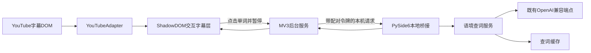

> 归档说明：本文件由 Cursor 计划 `交互字幕翻译演进_c501cbc1.plan.md` 入库。状态见文首 YAML；版本对照见 [`VERSION-PLANS.md`](../../VERSION-PLANS.md)。
# 交互字幕翻译演进计划

## 调研结论与范围
- 你描述的产品大概率属于 [Language Reactor](https://chromewebstore.google.com/detail/language-reactor-transfor/hjdmhfbgpdkkdfgjfiknaacjfjljpblc)、[Trancy](https://www.trancy.org/) 这一类；“悬停字幕自动暂停、即时查词”最接近 [HoverTranslate](https://github.com/kozii-d/hover-translate)，同时支持 YouTube/B 站的形态可参考 [SubsGen](https://chromewebstore.google.com/detail/subsgen-chinese-subtitle/hfhohlnemifmkpcimhfakelnogmddcbk) 和 [Lintro](https://github.com/p1aymaker9/lintro)。
- 首版不做“整条字幕持续 AI 翻译”：它会显著增加费用、延迟和字幕抖动。MVP 聚焦一个闭环：字幕可点词 → 点击即暂停 → 基于整句语境返回词义 → 关闭释义后按需恢复。
- 产品形态确定为“Chrome/Edge Manifest V3 插件 + 现有 PySide6 桌面端”，首发 YouTube；API Key 始终留在桌面端。

## 架构

## 实施步骤
1. **建立独立插件工程与站点适配层**
   - 新增 [`extension/`](extension/)（WXT + TypeScript + Manifest V3），包含 popup、background service worker、content script 和共享消息类型。
   - 定义 `SubtitleAdapter` 接口；首版 `YouTubeAdapter` 用 `MutationObserver` 监听 `.ytp-caption-segment`，把字幕 cue 交给统一渲染层，避免业务逻辑绑定 YouTube DOM。
   - 用 Shadow DOM 叠加交互字幕，不直接改写 YouTube 原字幕节点；字幕不可用时给出明确提示。

2. **完成点词暂停交互**
   - 使用 `Intl.Segmenter` 做英文单词/标点切分，每个词成为可聚焦、可点击元素；保留整句作为查词上下文。
   - 点击词时记录视频原播放状态并暂停，显示锚定词位的加载弹层；请求过期或字幕切换时用 `AbortController` 丢弃旧结果。
   - 弹层展示“当前语境词义 + 原形/词性 + 简短中文释义”；只有本次由插件触发暂停时，关闭弹层才提供自动恢复，避免覆盖用户主动暂停。

3. **给桌面端增加安全的本机翻译桥**
   - 新增 [`browser_bridge.py`](browser_bridge.py)，仅监听 `127.0.0.1`，提供健康检查、一次性配对和 `POST /v1/lookup`；请求必须携带配对令牌，并限制请求体、频率、来源和超时，绝不向插件返回 API Key。
   - 新增 [`word_lookup.py`](word_lookup.py)，复用 [`config.py`](config.py) 的 `LlmConfig`，但使用独立、无会话污染的结构化查词提示；不要直接复用 [`translator.py`](translator.py) 当前带历史消息的 `OpenAICompatTranslator`。
   - 在 [`main.py`](main.py) 随应用启动/退出桥接线程，并把成功查词写入现有历史/费用统计时标记来源为 `youtube_word_lookup`；增加小容量内存缓存，键包含目标语言、规范化单词和上下文句子。

4. **加入配对与设置体验**
   - 扩展 popup 显示桌面端在线状态、启用开关、目标语言和“连接桌面端”；首次连接使用一次性短码确认并将令牌保存在 `chrome.storage.local`。
   - 扩展 [`settings_dialog.py`](settings_dialog.py) 与 [`config.py`](config.py)：增加“浏览器集成”开关、固定本机端口、重新配对/撤销令牌；示例配置只放非敏感默认值。
   - 连接失败时只提示“请启动桌面端/重新配对”，不得回退为插件直存 API Key。

5. **验证与发布首版**
   - Python 侧覆盖鉴权、仅回环监听、输入校验、缓存、LLM 错误与退出清理；插件侧覆盖分词、字幕去重、暂停状态机、过期响应和 SPA 视频切换。
   - 用本地字幕 fixture 做自动化 DOM 测试，再在 Chrome/Edge 手测普通视频、自动字幕、全屏、影院模式、主动暂停、快速切视频及桌面端离线。
   - 更新 [`README.md`](README.md) 的开发者模式安装/配对说明；在 [`.github/workflows/release-windows.yml`](.github/workflows/release-windows.yml) 增加扩展 zip 构建产物。按仓库规则将 [`version.py`](version.py) 升为 `0.8.0`，并在 [`CHANGELOG.md`](CHANGELOG.md) 记录新功能。

## 后续路线（不纳入首版）
- 第二阶段：新增 `BilibiliAdapter`，复用同一交互层与本机桥；处理 B 站登录态字幕、播放器切 P 和全屏 DOM 差异。
- 第三阶段：双语整句预翻译、上一句/下一句/复读快捷键、生词收藏与历史筛选。
- 第四阶段：按真实使用数据决定是否加入悬停查词；默认仍保留点击触发，避免鼠标经过时频繁暂停和产生模型费用。
