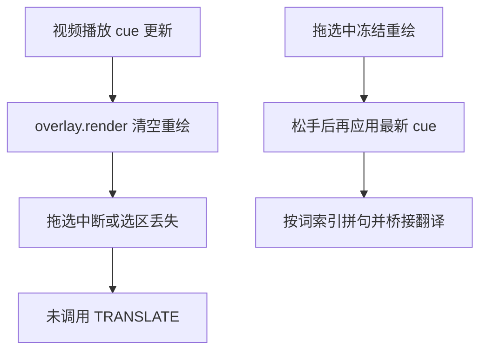

> 归档说明：本文件由 Cursor 计划 `划词换行与失效修复_76d113b0.plan.md` 入库。状态见文首 YAML；版本对照见 [`VERSION-PLANS.md`](../../VERSION-PLANS.md)。
# 划词原文换行与播放后失效

## 排查结论

### 问题 1：原文按词逐行
桌面端 [`window.py`](window.py) 的 `set_source` 只是 `setPlainText`，不会自行拆行。换行一定来自扩展送出的文本里带了 `\n`。

根因在 [`extension/src/overlay.ts`](extension/src/overlay.ts) 的选区合并逻辑：

```ts
const selected =
  (domSelected && domSelected.length >= spanText.length ? domSelected : spanText) || ...
```

字幕条是 `display:flex; flex-wrap:wrap`。Chrome 对跨行 flex 子项做 `Selection.toString()` 时，常在视觉换行处插入 `\n`。当前虽对 `domSelected` 做了 `\s+ → 空格`，但仍优先 DOM 选区，且与「按词索引拼接」的 `spanText` 混用，行为不稳定。截图里一词一行，正是典型的 flex 选区换行残留（或未重载扩展时的旧逻辑 / 手动 Ctrl+C 原始选区）。

**修复原则**：划词载荷**只**用词索引重建句子（词与词之间固定插空格），不再采用 DOM `Selection.toString()` 作为正文；发送前再统一 `replace(/\s+/g, " ").trim()`。

### 问题 2：播放并重新拉取后划词不再自动翻译
播放后 YouTube 字幕 cue 频繁变化 → [`youtube.ts`](extension/src/adapters/youtube.ts) 推送新 cue → [`overlay.render`](extension/src/overlay.ts) 执行 `replaceChildren()`，拖选过程中节点被拆掉，选区与 pointer 目标丢失，表现为「选了却没发出 `/v1/translate`」。

暂停时 cue 稳定，所以第一次容易成功；一点播放就失效——与现象吻合。

次要因素：`pointerdown` 只绑在 `.word` 上，从字幕条空白/间隙起拖时 `pointerStart` 为空，整次手势被忽略。



## 代码方案（小步）

### 1. 稳定拼句（修逐行原文）
文件：[`extension/src/overlay.ts`](extension/src/overlay.ts)

- `textBetweenWordIndexes`：只收集 `.word` 的 `dataset.word` / `textContent`，用单个空格 `join`，忽略 space/punct 节点的原始空白形态。
- `handleLinePointerUp`：划词路径**只使用**上述拼句结果；DOM 选区仅用于辅助判断是否在拖选，不作为正文来源。
- [`extension/src/content.ts`](extension/src/content.ts) 的 `sendPhraseToDesktop`：再做一次空白归一化后发送。

### 2. 拖选期间冻结字幕重绘（修播放后失效）
文件：[`extension/src/overlay.ts`](extension/src/overlay.ts)、[`extension/src/content.ts`](extension/src/content.ts)

- Overlay 增加 `isSelecting()` / 内部 `_pointerDown` 标志；`pointerdown` 置位，`pointerup`/`pointercancel` 清除。
- `render(text)`：若正在拖选，把文本存入 `_pendingCue`，**不** `replaceChildren`；松手后再 `render(_pendingCue)`。
- Adapter → content 的 cue 回调不变；冻结只发生在 overlay 层。

### 3. 手势起点放宽
- 在 `.line` 上监听 `pointerdown`：若命中词则记录该词索引；若点在间隙则就近吸附到最近 `.word`，保证从盒缝起拖也能划词。

### 4. 验证与版本
- 手测：暂停划词 → 原文单行；播放中划词 → 仍能弹出桌面窗；单击单词 → 仍为点词弹层。
- 升 patch `0.8.4`，更新 [`CHANGELOG.md`](CHANGELOG.md) / README 一句；重建 `extension/dist`。
- **需重启桌面端 + 扩展重新加载**（桥接逻辑已有，本轮主要改扩展）。

## 不做的范围
- 不改商店分发 / Native Messaging。
- 不把页面幻灯片上的蓝区选中纳入（仍仅交互字幕层）。
