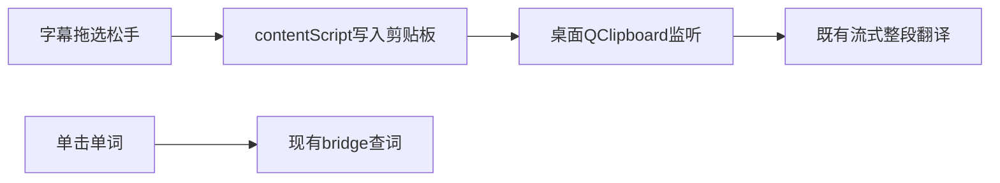

> 归档说明：本文件由 Cursor 计划 `字幕划词剪贴板翻译_bf64c8f9.plan.md` 入库。状态见文首 YAML；版本对照见 [`VERSION-PLANS.md`](../../VERSION-PLANS.md)。
# 字幕划词 → 剪贴板整段翻译

## 目标交互
- **单击单词**：保持现有点词查义（暂停 + 语境释义弹层）。
- **拖选一段字幕**：松手后将选中原文写入系统剪贴板 → 桌面端现有 `QClipboard` 流程自动翻译并弹出主窗。
- 打包分发 / Native Messaging 自动配对任务继续暂停，不纳入本轮。

## 实现思路（默认选这条）
在扩展侧用「点击 vs 拖选」区分手势，复用桌面剪贴板通道，避免再开一条翻译 API。

### 1. 扩展：区分单击与拖选
主要改 [`extension/src/overlay.ts`](extension/src/overlay.ts) / [`extension/src/content.ts`](extension/src/content.ts)：

- 单词 `pointerdown` 记录起点；`pointerup` 时若移动距离小于阈值（约 4px）且无有效选区 → 走点词查义。
- 若存在跨词选区（`shadowRoot.getSelection()` 或从选区取文本）且长度 ≥ 2 个有意义字符 → **不触发点词**，改为划词处理。
- 从 Shadow DOM 选区提取纯文本（去掉多余空白），过滤过短/过长（对齐桌面 `min_chars`/`max_chars` 量级即可）。

### 2. 写入剪贴板
- 在用户手势回调里调用 `navigator.clipboard.writeText(selectedText)`；失败则回退 `textarea` + `document.execCommand('copy')`。
- 成功后短暂 toast（如「已复制，桌面端翻译中…」），不暂停视频（整段翻译由桌面窗承担）。
- 可选：选区高亮保持到下一次点击，避免误以为没选中。

### 3. 桌面端：几乎不用改
- 现有 [`main.py`](main.py) 剪贴板 settle/confirm、缓存、历史已覆盖整段翻译。
- 仅确认扩展写入不会被「复制译文忽略窗」误伤（扩展写入的是原文，一般无问题）。
- 若后续发现焦点/权限导致 clipboard 事件偶发丢失，再在 bridge 增加 `POST /v1/translate_clipboard` 作备用；**首版不做**。

### 4. 体验细节
- 拖选过程中禁用单词 click 的默认查词，防止选到一半弹出释义。
- 全选当前一句：可后续加双击句子；首版只做拖选。
- README 补一句用法：拖选字幕 → 自动进桌面翻译窗。

### 5. 版本
- 用户可见行为变更：升 patch（如 `0.8.2`），写 [`CHANGELOG.md`](CHANGELOG.md)，重建 `extension/dist`。

## 不做的范围
- 不在弹层内做整段 AI 翻译（避免与桌面窗重复）。
- 不改打包分发 / 自动配对计划。
- 首版不覆盖网页任意选区（仅交互字幕层）；若你还需要「页面任意划词也进剪贴板」，可下一轮加 content script 全局手势。
