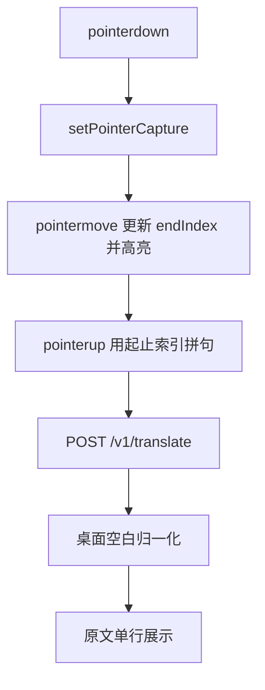

> 归档说明：本文件由 Cursor 计划 `划词稳定性加固_b383ef76.plan.md` 入库。状态见文首 YAML；版本对照见 [`VERSION-PLANS.md`](../../VERSION-PLANS.md)。
# 划词稳定性加固

## 根因（对照当前 0.8.4 代码）

### A. 「选了没反应」——手势经常根本没建立或中途丢失
当前 [`overlay.ts`](extension/src/overlay.ts) 仍开着 `user-select: text`，同时又用自定义 `pointerdown/up` 算词索引，两套机制打架。

高概率失败链：

1. **松手点打不准**：`handleLinePointerUp` 在 `await rAF` 之后才用 `wordElFromPoint` / `nearestWordEl(..., 36px)` 找终点。光标已离开字幕条、或落在 YouTube 底栏控件上时，终点吸附失败；若同时 `moved===false` 且 `from===to`，会落入「单击查词」或**什么都不做**（`moved` 为 true 但 `phrase` 空时直接静默结束）。
2. **按下未命中**：`beginSelectFromPoint` 近邻阈值仅 36px；从词缝/条外缘起拖时直接 `return`，`selecting` 不置位 → 既无原生选中外观，也不发 `TRANSLATE`（正符合「没选中也没翻译」）。
3. **事件被抢走**：未 `setPointerCapture`。播放后控制栏出现时，pointer 易被播放器接住 → `pointercancel` 走 `endSelectingAndFlush()`，**不发送翻译**。
4. **无拖选过程态**：没有 `pointermove` 更新终点索引，也没有自绘高亮；用户以为在「选中」，实际扩展侧可能从未进入有效划词。

暂停时控件隐藏、cue 稳定，所以成功率高；播放/刚拉字幕后失败多——与现象一致。

### B. 「有时原文仍有换行」——桌面未折叠空白
扩展侧词索引 `join(" ")` 已规避 flex 选区 `\n`，但：

- 仍保留 `user-select: text`，用户或浏览器可能把**带换行的原生选区**写进剪贴板；
- [`main.py`](main.py) `_normalize_clipboard_text` 只 `strip()`，**不**把 `\n`/`\s+` 收成单空格，剪贴板路径一旦带上换行就会原样进原文框。

## 修复方案（确定做法）

### 1. 扩展：自控划词，禁用原生选区
文件：[`extension/src/overlay.ts`](extension/src/overlay.ts)

- `.line` / `.word` 改为 `user-select: none`，去掉对 DOM `Selection` 的依赖。
- `pointerdown`：命中或近邻词（阈值提到约 48–64px）后 `lineEl.setPointerCapture(pointerId)`，`selecting=true`，记录 `startIndex`/`endIndex`。
- `pointermove`（capture 期间）：持续 `endIndex = nearestWord`，给 `[start..end]` 词加 `.word-selected` 高亮。
- `pointerup` / `pointercancel`：
  - 若 `endIndex !== startIndex` 或移动超过阈值 → 用词索引空格拼接发 `onPhraseSelect`；
  - 否则 → 单击点词查义；
  - 始终 `releasePointerCapture`、清高亮、再 `flush pendingCue`。
- 失败可见：若 capture 失败或松手无有效词，`showToast("未选中字幕，请在字幕条上拖选")`，避免静默。

### 2. 桌面：空白归一化（兜底换行）
文件：[`main.py`](main.py)

- `_normalize_clipboard_text`（及 bridge translate 入口复用处）增加：`re.sub(r"\s+", " ", text).strip()`，保证无论剪贴板还是 `/v1/translate`，原文都是单行句子。

### 3. 版本与验证
- 升 patch `0.8.5`，[`CHANGELOG.md`](CHANGELOG.md) 写清手势捕获/自绘高亮/空白折叠。
- 重建 `extension/dist`。
- 手测清单：暂停拖选、播放中拖选、从词缝起拖、拖出字幕条再松手、单击单词；确认原文无 `\n`，失败有 toast。

## 不做
- 不解析页面幻灯片蓝区选中。
- 不改商店分发 / Native Messaging。
