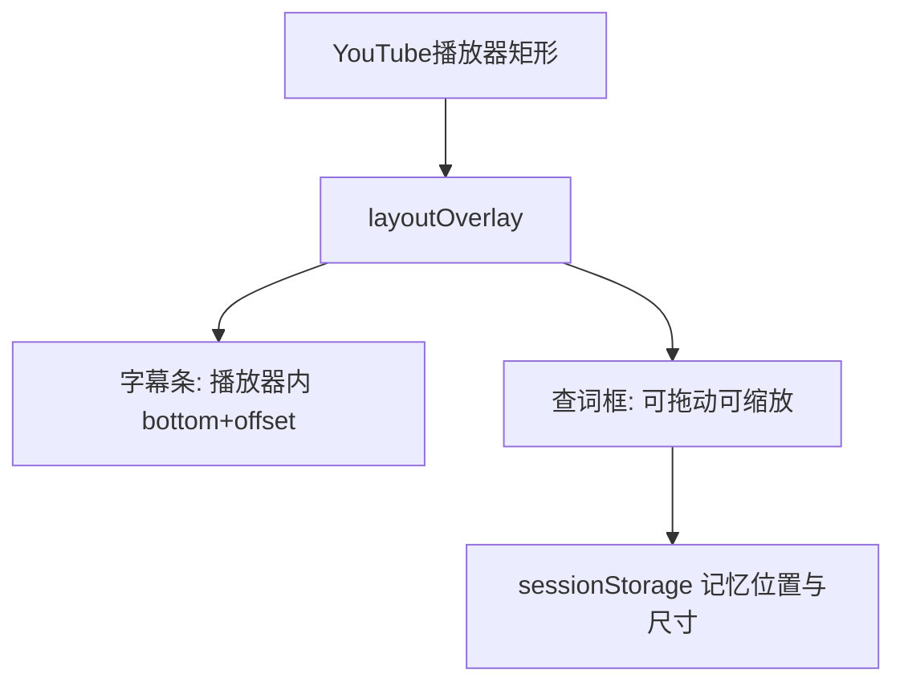

> 归档说明：本文件由 Cursor 计划 `字幕避让与弹层交互_79714d35.plan.md` 入库。状态见文首 YAML；版本对照见 [`VERSION-PLANS.md`](../../VERSION-PLANS.md)。
# 字幕避让与查词弹层拖拽缩放

## 问题原因
当前 [`extension/src/overlay.ts`](extension/src/overlay.ts) 用视口 `position: fixed; bottom: 12%` 放字幕条。非全屏时这会落在播放器下方的点赞/分享栏上（截图即此）。查词框也是固定定位，且每次 `innerHTML` 重建后丢失交互能力。

## 方案
默认采用**播放器感知定位**：字幕叠在 `#movie_player` / `.html5-video-player` 内部偏下，并预留控制栏高度；查词框支持标题栏拖动 + 右下角缩放。

## 改动文件
主要改 [`extension/src/overlay.ts`](extension/src/overlay.ts)；[`extension/src/adapters/youtube.ts`](extension/src/adapters/youtube.ts) 仅补充 `getPlayerElement()`；小幅升版与 CHANGELOG。

### 1. 字幕条避让底部栏
- 用播放器 `getBoundingClientRect()` 计算字幕 `.wrap` 的 `left/top/width`，不再用视口 `bottom: 12%`。
- 默认放在播放器底部向上约 `72px`（控制栏显隐时取 `56–96px` 安全带）；宽度限制在播放器内，左右各留边距。
- `resize` / `scroll` / YouTube 全屏切换时重新 `layout()`；全屏同样相对播放器矩形。
- 保持 Shadow DOM；原生字幕仍隐藏，避免双层字幕。

### 2. 查词框拖动
- 弹层结构改为：标题栏（词头，`cursor: move`）+ 正文 + 底部按钮；拖动只绑标题栏，避免误拖按钮。
- `pointerdown/move/up` 更新 `left/top`；拖出视口时钳制边距。
- 用户拖过之后，同一次查词/后续结果刷新不再强制锚回单词位置；关闭弹层后下次点击单词再按锚点重新打开。

### 3. 查词框缩放
- 右下角增加 resize handle；拖拽改变 `width/height`，设合理最小（约 200×120）与最大（视口 90%）。
- 正文区 `overflow: auto`；字号可用简单 `+/-` 或随高度略调，首版以**框体缩放 + 内部滚动**为主（实现稳、不挡字幕）。
- 将用户调整后的宽高写入 `sessionStorage`（如 `ct.tipSize`），同标签页复用。

### 4. 重建 DOM 时保持行为
- `showLoading` / `showResult` / `showError` 只更新内容节点，不整段替换 `.tip`，以免丢掉拖拽/缩放监听。
- 关闭按钮逻辑保持：关闭并按需恢复播放。

### 5. 验证与版本
- 手测：普通页、影院模式、全屏、控制栏显隐、拖动弹层、缩放后继续查词。
- 按 [`AGENTS.md`](AGENTS.md) 升 patch（如 `0.8.1`），更新 [`CHANGELOG.md`](CHANGELOG.md)；重建 `extension/dist`。

## 不做的范围
- 本轮不让整条字幕条可拖（先靠播放器内上移解决遮挡）。
- 不改桌面桥接/配对协议。
