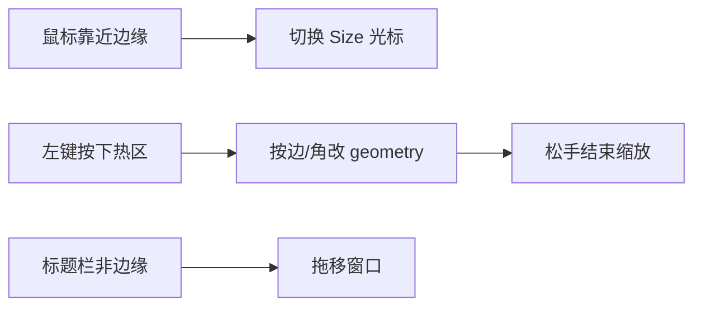

> 归档说明：本文件由 Cursor 计划 `窗口边缘缩放_16db4c5c.plan.md` 入库。状态见文首 YAML；版本对照见 [`VERSION-PLANS.md`](../../VERSION-PLANS.md)。
# 主窗口四边拖拽缩放

## 背景

[`window.py`](window.py) 中 `TranslatorWindow` 使用 `FramelessWindowHint`，默认 `440×400`、最小 `340×280`，首次显示锚定右下角。目前仅 [`TitleBar`](window.py) 支持拖移，**无边缘缩放**。

## 方案

在 `TranslatorWindow` 内实现跨平台（Win/macOS）边缘缩放，不依赖原生边框：

1. **命中区**：窗口内缘约 **6px**；上下左右四边，四角重叠区做对角缩放（一次实现更完整，光标用标准 `Size*`）。
2. **事件路径**：对窗口及子控件安装 `eventFilter`（或在 `TranslatorWindow` 统一过滤），在边缘热区内拦截 `MouseMove` / `MouseButtonPress` / `MouseButtonRelease`，避免被 `QTextEdit` 吞掉。
3. **几何更新**：按下时记录边/角与起始 `geometry` + 全局坐标；拖动时按边调整 `setGeometry`，遵守 `minimumSize()`；松手结束。
4. **与标题栏拖移分流**：靠近顶边热区时优先缩放；`TitleBar` 仅在非边缘热区时继续 `move`。右上角按钮区不启动缩放（按钮本身已消费点击）。
5. **不持久化宽高**：与当前不保存窗口位置一致；重启仍用默认尺寸 + 右下角锚定。用户缩放后不触发重新锚定（沿用 `_user_placed`：缩放开始或结束时置 `True`，避免再次被拉回右下角）。

## 主要改动

| 文件 | 改动 |
|------|------|
| [`window.py`](window.py) | 增加边缘枚举、命中检测、光标、`eventFilter`、缩放状态机；`TitleBar` 在边缘热区不启动拖移 |
| [`version.py`](version.py) | `0.5.0` → `0.6.0`（新功能，minor） |
| [`CHANGELOG.md`](CHANGELOG.md) | Added：无边框窗口支持拖边缘/角缩放 |
| [`README.md`](README.md) | 在「可拖动」旁补一句可拖边缘调整大小 |

不改 `config.toml` / 设置项；不引入平台分支（几何逻辑继续共用）。

## 实现要点（落在 `TranslatorWindow`）

- 常量：`_RESIZE_MARGIN = 6`
- 状态：`_resize_edges`（bit flags：L/R/T/B）、`_resize_origin_geo`、`_resize_origin_global`
- `mouseMove`（未按下）：按命中更新 `setCursor`
- 拖动中：例如拖左边 → `x`/`width` 联动且 `width >= minWidth`；顶边同理；底/右只改 `height`/`width`
- 子控件新增时需能收到过滤：在 `showEvent` 或构建完成后对 central widget 树安装 filter（递归安装一次即可）

## 验证

- 本地结束旧进程后用 `.venv` 启动 `main.py`
- 分别拖上/下/左/右边缘与四角，确认光标与尺寸变化、不低于 `340×280`
- 标题栏空白处仍可拖移；顶边缩放不与拖移打架
- 正文区选中文字不受影响（非边缘）
- 置顶切换后几何仍保持（现有 `setGeometry` 路径不变）
