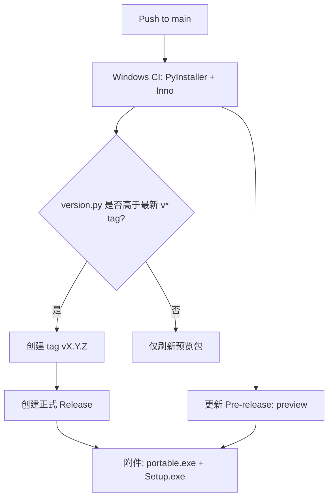

> 归档说明：本文件由 Cursor 计划 `windows_打包发布_25e77164.plan.md` 入库。状态见文首 YAML；版本对照见 [`VERSION-PLANS.md`](../../VERSION-PLANS.md)。
# clipboard-translator Windows 安装版 / 便携版自动发布

目标仓库：[zhuji423/clipboard-translator](https://github.com/zhuji423/clipboard-translator.git)（目录 [`clipboard-translator/`](clipboard-translator/)）。

## 发布模型（已选定）

- **每次** `push` 到 `main`：构建并刷新滚动预览发布 `preview`（`prerelease: true`），附件始终是最新构建，下载链接稳定。
- **当** [`version.py`](clipboard-translator/version.py) 中 `__version__` 尚无对应 `vX.Y.Z` tag 时：CI 自动创建该 tag，并创建**正式** GitHub Release（非 prerelease），Release notes 从 [`CHANGELOG.md`](clipboard-translator/CHANGELOG.md) 截取对应版本段。
- 开发日常流：改功能 → 按 [`AGENTS.md`](clipboard-translator/AGENTS.md) 升 `version.py` + 写 CHANGELOG → push `main` → 同时得到预览包 + 正式版（若版本号是新的）。
- 同一版本的后续纯 CI/文档小修：只更新 `preview`，不再重复发正式版。

预览产物命名带 short SHA，便于区分构建；正式版命名带 SemVer。

## 打包产物

| 产物 | 说明 |
|------|------|
| `ClipboardTranslator-{version}-portable.exe` | PyInstaller **onefile**，下载即跑 |
| `ClipboardTranslator-{version}-Setup.exe` | Inno Setup 安装包：写入 `%LocalAppData%\Programs\ClipboardTranslator`、开始菜单、卸载项；可选「开机自启」 |

两者都托盘常驻（沿用现有 `setQuitOnLastWindowClosed(False)`）。

## 运行时路径（打包前必须改）

当前 [`config.py`](clipboard-translator/config.py) / [`history_store.py`](clipboard-translator/history_store.py) / [`icons.py`](clipboard-translator/icons.py) 都用 `Path(__file__).parent`，打包后会写不进安装目录或找不到资源。

新增统一路径模块（如 `paths.py`）：

- **资源目录**（只读）：开发时为仓库根；frozen 时为 `sys._MEIPASS`（onefile）或 exe 旁（onedir）
- **用户数据目录**（可写）：`%APPDATA%\ClipboardTranslator\`
  - `config.toml`
  - `data/history-*.jsonl`
- 首次启动：若用户目录无 `config.toml`，从打包内的 `config.example.toml` 复制过去；缺密钥时弹窗引导去设置（可先保证能启动托盘，而不是直接退出——至少在「安装后首次运行」场景可用；LLM 项仍可在现有设置能力上最小扩展，或沿用复制示例后提示编辑配置文件路径）。

`config.example.toml` 打进包；真实 `config.toml` 永不进包（已在 `.gitignore`）。

## 本地 / CI 构建骨架

新增文件（均在 `clipboard-translator/` 下）：

- `clipboard_translator.spec` — PyInstaller：入口 `main.py`，收集 `assets/icons/*`、`config.example.toml`，产品名/版本读 `version.py`
- `installer/setup.iss` — Inno Setup：包装 **onedir** 构建结果（启动更快、安装更稳），生成 `Setup.exe`；便携版另出 onefile
- `scripts/build_windows.ps1` — 本地一键：`pip install` → pyinstaller → ISCC
- `requirements-build.txt` — `pyinstaller` 等构建依赖
- `.github/workflows/release-windows.yml` — 上述发布逻辑

CI 要点（`windows-latest`）：

1. checkout + setup-python + 安装 `requirements.txt` + `requirements-build.txt`
2. 读出版本号
3. PyInstaller 产出 `dist/portable/`（onefile）与 `dist/app/`（onedir）
4. 安装 Inno Setup（Chocolatey 或官方静默安装），编译 `setup.iss`
5. 用 `softprops/action-gh-release`（或等价）：
   - 始终 upsert Pre-release tag `preview`
   - 若需正式版：`git tag v$VER` + push tag + create release（需 `permissions: contents: write`）

## 文档与 Agent 约定

- [`README.md`](clipboard-translator/README.md)：增加「下载安装 / 便携版 / 预览版链接 / 配置位置 `%APPDATA%\ClipboardTranslator`」
- [`AGENTS.md`](clipboard-translator/AGENTS.md)：补充「升版 push main 即触发正式 Release；勿手打 tag（除非热修）」
- 过程说明可写短篇 `PLAN-windows-release.md`（符合现有文档分工）
- 本能力属用户可见交付方式变更 → 升 **minor**（例如 `0.1.0` → `0.2.0`）并写 CHANGELOG

## 刻意不做（本阶段）

- 代码签名（未签名 EXE 可能被 SmartScreen 拦截；个人项目先接受，后续再加证书）
- 自动更新（托盘内检查新版本）；用户暂从 GitHub Release 手动下载
- macOS / Linux 包

## 验收标准

- 从 `preview` Pre-release 下载两个 EXE，均可在干净 Windows 上启动并出现托盘
- 安装版出现在「应用和功能」、可卸载；勾选开机自启后重启仍在托盘
- 配置与历史落在 `%APPDATA%\ClipboardTranslator`，升级安装不丢配置
- push 升高 `version.py` 后自动出现 `vX.Y.Z` Release；同版本再 push 只刷新 `preview`
