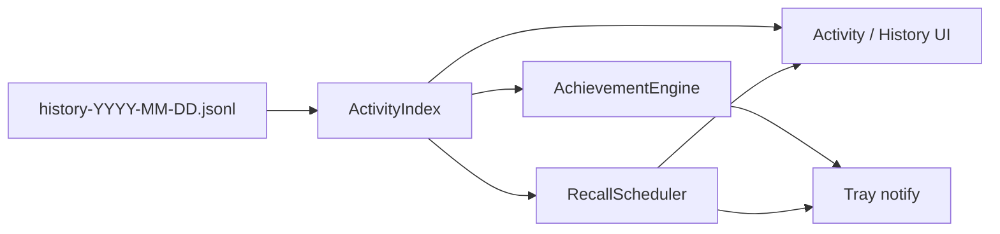

# 活动绿格子、成就与回想系统

## 一句话

把「今天又翻了多少句」做成 GitHub 式贡献热力图与轻量成就；并在合适时机用托盘/卡片偶发推送「你以前在干什么、粘贴了什么」，把历史从流水账变成可回望的个人时间线。

## 与现状关系

- 已有按日 JSONL：[`history_store.py`](../../history_store.py) → `data/history-YYYY-MM-DD.jsonl`
- 每条含 `ts` / `source` / `result` / `mode`（`translate` | `answer`）等，**日计数与抽样回想可直接从现有历史派生**，不必先改写入格式
- 已有历史对话框 [`history.py`](../../history.py)、托盘 `QSystemTrayIcon.showMessage`（[`main.py`](../../main.py)）
- 与 [`account-sync-byok.md`](account-sync-byok.md) 正交：本功能默认**纯本地**；若日后云同步，热力/成就按本地合并后的历史重算即可

## 产品目标

| 层面 | 用户感知 |
|------|----------|
| **绿格子（Activity）** | 一年视图：每天一格，颜色深浅 = 当日翻译/问答次数（或加权） |
| **成就（Achievements）** | 连续天数、累计次数、单日高峰等徽章；偏「轻游戏化」，不刷屏 |
| **回想（Recall）** | 偶尔弹出：某天、某条原文/译文摘要，像「一年前的今天」或「随机一段旧记忆」 |

核心情绪：**成就感 + 偶然的旧事回望**，而不是又一个统计仪表盘。

## 隐私（硬约束）

粘贴板内容可能含密码、密钥、隐私对话。默认策略：

1. **热力图只展示计数**，格子 hover 最多显示「N 次 / 费用」类元数据，不默认展示原文
2. **回想推送默认关闭或需显式开启**；开启后仍可配置：
   - 仅推送「有过活动」的元信息（日期 + 次数），不带正文
   - 或推送正文时做截断（如前 80 字）+ 可一键「今日不再回想」
3. 设置里提供：**关闭回想**、**清空成就状态不影响历史 JSONL**、可选「敏感日静默」（某日不参与抽样）
4. 全文永不上传；不依赖账号体系

## 数据模型（本地增量）

在现有 JSONL 之上增加轻量派生层即可：

| 存储 | 内容 | 说明 |
|------|------|------|
| 派生索引（可缓存） | `day → count / by_mode / cost` | 启动或按日扫描 `history-*.jsonl`；可写 `data/activity-index.json` 加速 |
| `data/achievements.json` | 已解锁徽章 id、解锁时间、连续天数快照 | 可重算；文件损坏可从历史重建 |
| `data/recall-state.json` | 上次推送时间、已展示 entry 指纹、用户静默偏好 | 避免同一条反复推、控制频率 |

条目指纹建议：`sha256(day + ts + len(source))` 一类，**不落库明文副本**。

不强制改 `HistoryEntry` 字段；若日后需要「是否排除出回想」，再加可选 `flags` / `note` 约定。

## UX 草案

### 1. 活动页 / 历史增强

- 入口：历史对话框顶部，或设置旁「活动」页（二选一，优先嵌在历史，少开窗口）
- **GitHub 风格年热力图**：约 53×7 格；等级 0–4（按分位数或固定阈值：0 / 1–2 / 3–5 / 6–10 / 11+）
- 点击某日：右侧/下方列出当日条目（复用现有日列表）
- 文案：「今年已翻译 N 次 · 最长连续 M 天」

### 2. 成就

示例徽章（首版少而准，可配置扩展）：

| id | 条件 |
|----|------|
| `first_translate` | 第 1 次翻译 |
| `streak_3` / `7` / `30` | 连续有活动日 |
| `total_100` / `1000` | 累计次数 |
| `busy_day_20` | 单日 ≥ 20 |
| `answer_first` | 首次问答模式 |

解锁：托盘短提示一次 + 活动页「新徽章」点亮；不弹模态打断翻译流。

### 3. 回想推送

触发策略（可并存，均可关）：

- **时间锚点**：「去年今天 / 上周同日」若有记录则优先
- **随机稀疏**：距上次推送 ≥ N 小时（默认 24–72h 可配），且当日已有至少 1 次使用后再推（避免冷启动打扰）
- **内容**：日期 + 模式 + 原文/译文截断；点击打开历史并定位到该日

形态：优先系统托盘气泡；可选应用内非模态卡片（与翻译窗并存时勿抢焦点）。

## 架构草图

建议模块（命名可调）：

- `activity_index.py`：按日聚合、热力图等级、连续天数
- `achievements.py`：条件检测、持久化、去重解锁
- `recall.py`：抽样、冷却、指纹、文案组装
- UI：扩 `history.py` 或新建 `activity.py` 对话框

## 分阶段

### Phase A — 绿格子 MVP（建议先做）

- 从现有 JSONL 聚合日计数
- 历史页嵌入年热力图 + 连续天数文案
- 无推送、无成就文件

### Phase B — 成就

- `achievements.json` + 托盘解锁提示
- 活动页徽章墙

### Phase C — 回想

- 设置开关默认关或默认「仅元数据」
- 冷却调度 + 托盘回想 + 点击跳转历史日
- 正文截断与「今日勿扰」

### 可选后续

- 按 `mode` 分色 / 双层热力（翻译 vs 问答）
- 导出「年度回顾」静态图（本地生成 PNG，不上云）
- 与账户同步后的多机合并日计数

## 非目标（本计划不做）

- 社交排行榜、公开分享主页
- 服务端存粘贴正文
- 强游戏化任务列表（每日强制 quota）
- 改翻译主路径性能特征（索引构建须后台/懒加载）

## 验收（落地时）

- [ ] 有历史数据的机器打开活动视图可见合理绿格子（空日为空格）
- [ ] 当日新翻译后刷新（或下次打开）格子加深
- [ ] 成就只解锁一次；删徽章文件可重建已满足条件的徽章
- [ ] 回想关闭时永不弹正文；开启后遵守冷却与截断
- [ ] 升版：`version.py` + `CHANGELOG` + 本计划迁 `plans/history` + `VERSION-PLANS`

## 开放问题（实现前需拍板）

1. **计数口径**：仅成功写入历史的条目，还是含缓存命中？建议 = 现有 `HistoryStore.append` 次数（与历史一致）。
2. **回想默认**：默认关，还是默认「只推日期次数」？
3. **入口**：嵌历史对话框 vs 独立「活动」窗？
4. **目标版本**：倾向单独 minor（如 0.12.x），在字幕/账户大图之外穿插 Phase A。
